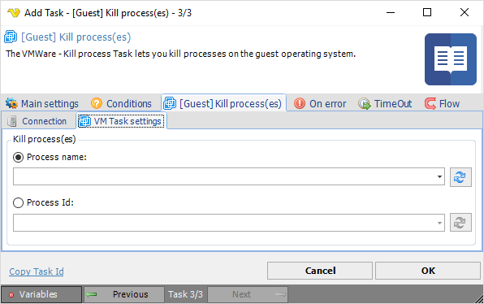

## Task VMWare - [Guest] Kill Process

The VMWare - Kill process Task lets you kill processes in the guest operating system.
 
**[Guest] Kill process(es) > Connection** sub tab

The Connection settings window is the same for all VMWare Task types. See [Start VM](start-vm) for details.
 
**[Guest] Kill process(es) > VM Task settings** sub tab

**Process name**

The name of the process you want to kill. Click the *Refresh* icon to populate the drop-down list with active process names.
 
**Process Id**

The process id of the process you want to kill. Click the *Refresh* icon to populate the drop-down list with active process IDs.