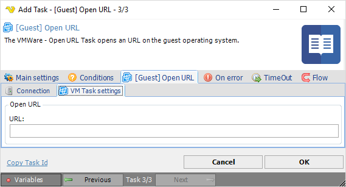

## Task VMWare - [Guest] Open URL

The VMWare - Open URL Task opens an URL on the guest operating system.
 
**[Guest] Open URL > Connection** sub tab

The Connection settings window is the same for all VMWare Task types. See [Start VM](start-vm) for details.
 
**[Guest] Open URL > VM Task settings** sub tab

**URL**

The URL you want to open.