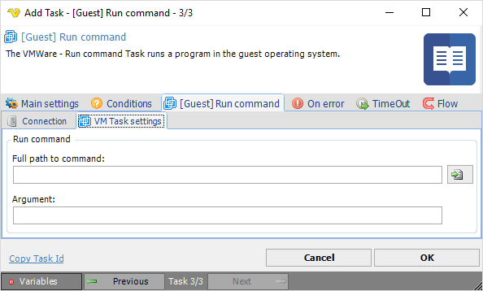

## Task VMWare - [Guest] Run Command

The VMWare - Run command Task runs a program in the guest operating system.
 
**[Guest] Run command > Connection** sub tab

The Connection settings window is the same for all VMWare Task types. See [Start VM](start-vm) for details.
 
**[Guest] Run command > VM Task settings** sub tab

**Full path to command**

The full path to executable/batch file/etc. Click the *File* icon to browse files and select a command file.
 
**Argument**

The argument for the command.

