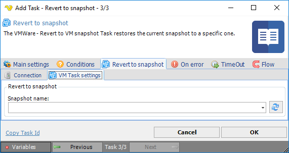

## Task VMWare - Revert to VM Snapshot

The VMWare - Revert to VM snapshot Task restores the current snapshot to a specific one.
 
**Revert to snapshot > Connection** sub tab

The Connection settings window is the same for all VMWare Task types. See [Start VM](start-vm) for details.
 
**Revert to snapshot > VM Task setting**s sub tab

**Snapshot name**

The name of the snapshot. Click the *Refresh* icon to populate the drop-down snapshot list.