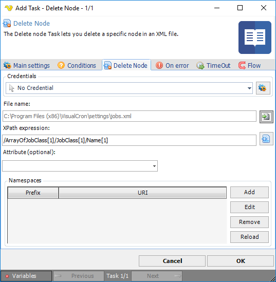

## Task XML - Delete Node

The Delete node Task lets you delete a specific node in a XML file.

**Credentials**

To control a remote computer you may need to use a Credential. The Credential must match the user name and password of the user that you want to login for. Select a Credential in the combo box or click the *Settings* icon to open *Manage credentials* in order to add or edit Credentials.
 
**File name**

The full path to the XML file.
 
**XPath expression**

XPath is a query language used for finding a specific object within XML. Enter the query manually or use the XPath browser by clicking the button.
 
**Attribute**

If a specific attribute should be deleted then set the attribute name here.