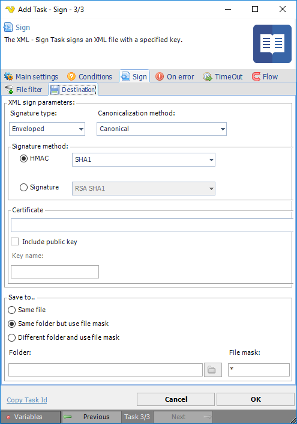

## Task XML - Sign

The XML - Sign Task signs an XML file with a specified key.
 
**XML Sign > File filter > Location **sub tab

The XML Transform Task uses the standard VisualCron [File filter](../../../server/job-tasks-file-filter) to define the properties of the listed files.
 
**XML Sign > Destination** sub tab

**Signature type**

Select the XML digital signature type to be used.
 
**Canonicalization method**

Select method for converting data into a "standard", "normal", or canonical form.
 
**Signature method**

The signature method to use for signing the request. This provides a valid hashing algorithm for signature calculation. Select HMAC or Signature main types and the desired sub type.
 
**Certificate**

In order to sign you need a certificate that includes a private key. Click the *Settings* icon to open the *Manage Certificates* dialog where a certificate is selected, imported or created.
 
**Include public key**

Specifies whether the key itself (its public part) must be included to the signature.
 
**Key name**

Enter the public key name to be able to decrypt. The KeyName element contains a string value (in which white space is significant) which may be used by the signer to communicate a key identifier to the recipient. Typically, KeyName contains an identifier related to the key pair used to sign the message, but it may contain other protocol-related information that indirectly identifies a key pair. Common uses of KeyName include simple string names for keys, a key index, a distinguished name (DN), an email address, etc.
 
**Save to**

Enter destination file and folder names.
 
**Folder**

If Different folder and use file mask is selected, use manual folder specification or click the Folder icon.
 
**File mask**

Save file with different name.