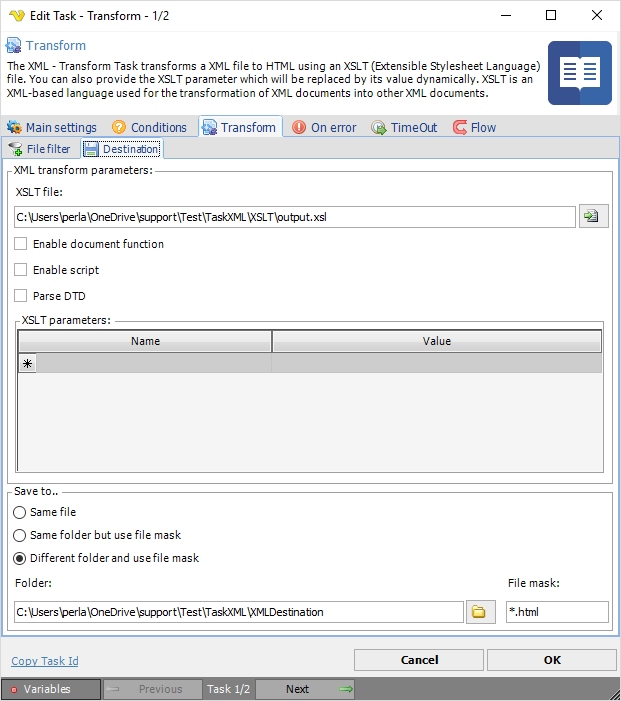

## Task XML - Transform

The XML - Transform Task transforms a XML file to HTML using an XSLT (Extensible Stylesheet Language) file. You can also provide the XSLT parameter which will be replaced by its value dynamically. XSLT is an XML-based language used for the transformation of XML documents into other XML documents.
 
The original document is not changed; rather, a new document is created based on the code of an existing one. The new document can be output to HTML or plain text.
 
**XML Transform > File filter > Location** sub tab

The XML Transform Task uses the standard VisualCron [File filter](../../../server/job-tasks-file-filter) to define the properties of the listed files.
 
**XML Transform > Destination** sub tab

**XLST file**

The path and file name of a XSLT file that resides on the local system which will be used to transform the specified XML file. Click the *Folder* icon to select the XSL folder/file.
 
**Enable document function**

If checked, support for the XSLT document function is enabled.
 
**Enable script**

If checked, support for embedded script blocks is enabled.
 
**Parse DTD**

If checked, the DTD will be parsed. Within an XML document's `<!DOCTYPE>`, there can be an internal subset of the DTD, or an external DTD can be referenced. In order to fully comply with the XML 1.0 or 1.1 specification, DTD must be parsed.
 
**XLST parameters**

Add/edit a XLST parameter using name and value to the parameter list. Select and press the Windows Del button to delete a parameter.
 
**Save to**

Enter destination file and folder names.
 
**Folder**

If Different folder and use file mask is selected, use manual folder specification or click the Folder icon.
 
**File mask**

Save file with different name.