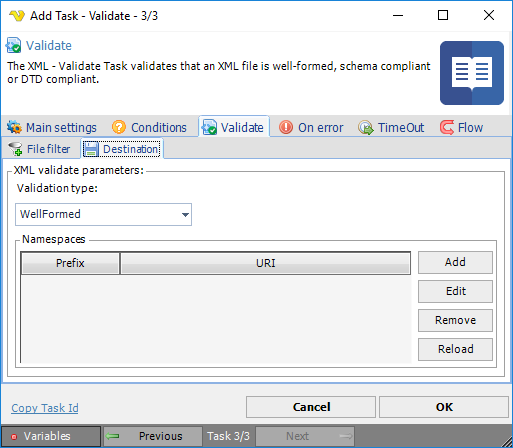
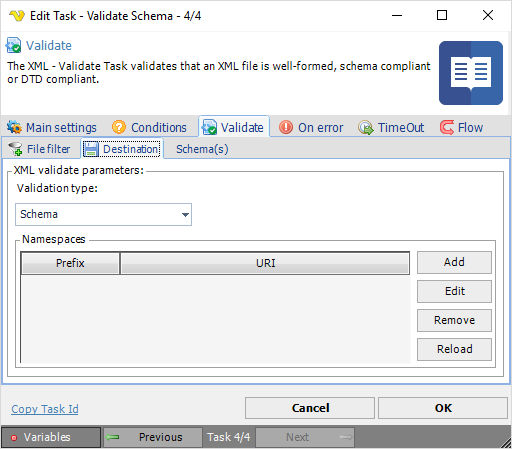

## Task XML - Validate

The XML - Validate Task validates that an XML file is well-formed, schema compliant or DTD compliant.
 
A XML document with correct syntax is called "Well Formed". An XML document validated against a DTD or a Schema is both "Well Formed" and "Valid".
 
**XML Validate > File filter > Location** sub tab

The XML Transform Task uses the standard VisualCron [File filter](../../../server/job-tasks-file-filter) to define the properties of the listed files.
 
**XML Validate > Destination** sub tab

**Validation type**

A XML document with correct syntax is called "Well Formed". Schema validation uses a schema file (*.xsd), default attributes are expanded from schema and type information is supplied. Document Type Definition (DTD) validation expands default attributes and entities, but general entities are loaded and parsed only if they are used (expanded). No type information is supplied.
 
**Namespaces**

A list of namespace prefix/namespace URI items, to uniquely identify an element, to be used for validation.
 
**XML Validate > Destination - Schema** sub tab

If *Validation type Schema* is selected, an extra sub tab is added to define the external schema file. The extra **XML Validate > Schema(s) > Location** sub tab has the same layout as the above referred X**ML Validate > File filter > Location** sub tab.

