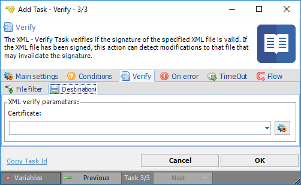

## Task XML - Verify

The XML - Verify Task verifies if the signature of the specified XML file is valid. If the XML file has been signed, this action can detect modifications to that file that may invalidate the signature.
 
**XML Verify > File filter > Location** sub tab

The XML Transform Task uses the standard VisualCron [File filter](../../../server/job-tasks-file-filter) to define the properties of the listed files.
 
**XML Verify > Destination** sub tab

**Certificate**

Click the *Settings* icon to open the *Manage Certificates* dialog where a certificate is selected, imported or created.