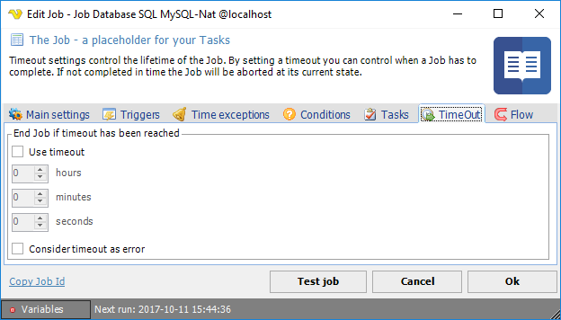

## Job - Timeout

he timeout value can be set both at Job and Task level, for Task level see [Task - Timeout](tasktimeout) for more information.
 
**Add/Edit Job > Timeout** tab

When the timeout is activated, all processes related the current Job will be terminated.

