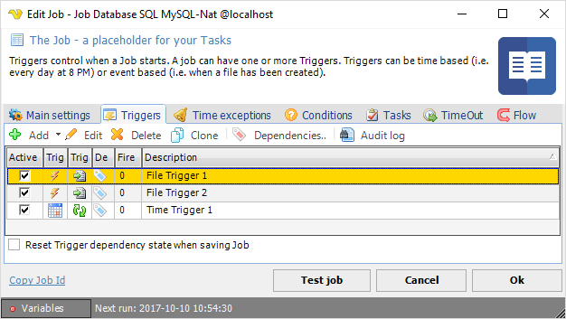
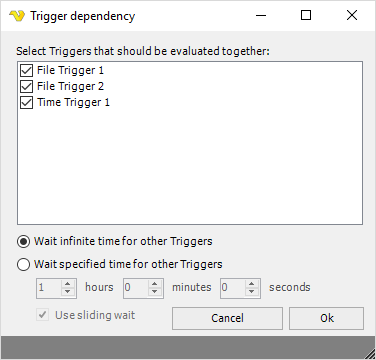

## Job Triggers

A Trigger is a part of a Job, the object that starts a Job. One Job can have one or more Triggers. A Trigger can either be based on Time (for example _Every minute_) or a system event (a file has been created). By default, Triggers are executed in an "OR-matter". This means Triggers do not wait for each other to start the Job. You can create dependencies between one or more Triggers.
 
By invoking the _Add Job, Clone Job or Edit Job_ functions, the **Triggers** tab can be opened.
 
**Job > Triggers** tab

**Add**

By pressing the Add button, the different Time Trigger and Event Trigger options are listed.
 
**Edit**

Opens a Trigger for edit. Select a row first.
 
**Delete**

Deletes a Trigger. Select a row first.
 
**Dependencies**

By default, Triggers are executed in an "OR-matter". This means Triggers do not wait for each other to start the Job. You can create dependencies between one or more Triggers by clicking on Dependencies..
 
**Job > Tiggers > Dependency**

**Trigger selection**

In the check list box you can select all Triggers that should be in a dependency.
 
**Wait type**

For a Job to start all Triggers must fire (if a dependency exist) at least once. The wait time defines how long time before the state of firing should exist.
 
**Wait infinite time for other Triggers**

VisualCron will never reset state. For example, Trigger 1 might fire 1000 times and the Job will still not start because Trigger 2 has not yet fired.
 
**Wait specified time for other Triggers**

After a specified time the state will be reset on all Triggers in the dependency. If you want to use this option then select a time until the state should be reset.
 
**Use sliding wait**

When using specified time you can use sliding wait. This means that the state wait time will be reset for each Trigger that fires.
 
The grid in the **Job > Triggers** tab

The Trigger grid listing contains all Triggers that belong to the current Job. Each trigger is listed as a row in the Description table under the Add, Edit and Delete buttons. Mouse double-click on any part of the trigger row opens the same window as the Edit button.

The grid has 6 columns:

**Active**

By default Active. This checkbox indicates/controls if a Trigger should be active or not (if active it is waiting for the time/events).

**Trigger type**

This icon shows if it is a Time or Event Trigger.

**Trigger inner type**
This icon shows what kind of Time or Event Trigger. For example if the Event Trigger is of inner type File Trigger.

**Dependency image**

By default, Triggers are executed in an "OR-matter". This means Triggers do not wait for each other to start the Job. You can create dependencies between one or more Triggers. When a Trigger is not in a dependency this column is blank - otherwise, it will have a        unique tag icon for each dependency collection.

**Fired times of Trigger in dependency**

How many times a Trigger has fired. This is only updated for Triggers within a dependency. A Job with dependencies do only fire when all Triggers have been fired once. After that - the fired times is reset.

**Description**

Name/description of the Trigger.
 
**Reset Trigger dependency state when saving Job**

This resets the state to zero on all Trigger that has a dependency.
 
**Next run**

The Date/time for the next run is shown in the bottom of the Job window.