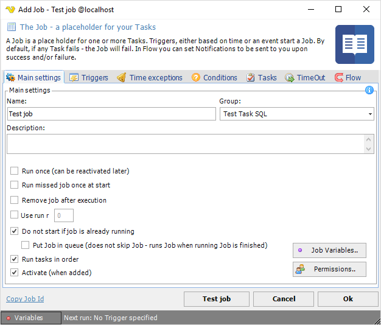
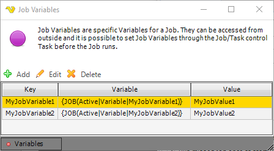
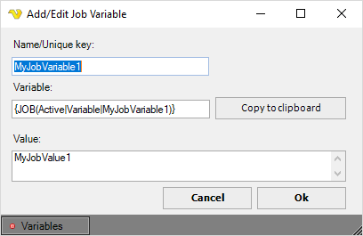

## Job Variables

Job Variables are values/parameters that is connected to a specific Job. When comparing Job Variables with [User Variables](../server/global-variables) there are a couple of differences:
* Job Variables are stored in the Job and not global like User Variables - still it is possible to refer to a Job Variable from another place in VisualCron
* It is possible to override existing Job Variables with the [Job/Task Control Task](../server/job-tasks/internal-tasks/control)
* The Job Variables are edited from the main settings of the Job while the User Variables are edited in the Variables browser
* In the Variables browser you can see the Job Variables beneath each Job node while the User Variables are located under the User Variables node
 
**Editing Job Variables**

You find the Job Variables for a specific Job in the Job > Main settings tab by clicking on the Job Variables.. button in the lower right corner.
 
**Add Job > Main settings**

**Job Variables**

In the Job Variables window all Variables that are connected to the current Job are listed. You can Add new, Edit or Delete by clicking the buttons or by double click on row.

**Add/Edit Job Variable**

The add/edit Job Variable window lets you Add a new or Edit an existing Job Variable.
 

