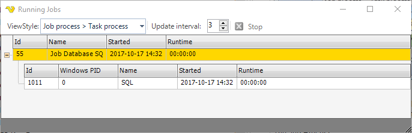

## Jobs - Running Jobs

The VisualCron processes are monitored and ended from the main menu **Server > Jobs > Running Jobs** dialog. With this dialog all VisualCron processes are viewed, even those not visible in Windows Task Manager (e.g. a web request).
 
All processes that are started by VisualCron can be handled by the VisualCron client application.
 
**Jobs > Running Jobs**

### Job process

When a Job is run by VisualCron a Job Process is started. A Job Process is a temporary working version of a Job. There can only exist one unique Job but many Job Processes derived from that Job, for example, many Jobs running at the same time.
 
The Job Process:
* keeps track of all Tasks that should be run
* checks conditions
* sends notifications
* updates the client with new status for a Task
 
### Task process

A Task Process is created when a Task is run. The Task Process:
* notifies the client when a Task is started and completed
* performs the action, for example runs a command or POST to a website
 
The Task Process has an Id which enables control of the actual Task Process. A Task Process is a temporary version of a Task. There can only exist one unique Task but many Task Processes derived from that Task. This occurs when many Job Processes are running at the same time.
 
### The Process Manager

In the process manager you can see all active processes. You are also able to Stop these processes in different ways. The result of pressing the Stop button is dependent on currently selected row and _ViewStyle_.
 
The selectable view styles changes the way VisualCron presents the hierarchy of the processes and also affects how the Stop button will work.
 
When you click on _Stop_ on a:
* Job row - all Job Processes and its Task Process will be stopped
* Task row - all Task Processes that are spawned from the Task will be stopped
* Job Process - the Job Process and its Task Processes will be stopped
* Task Process - a single Task Process will be stopped

