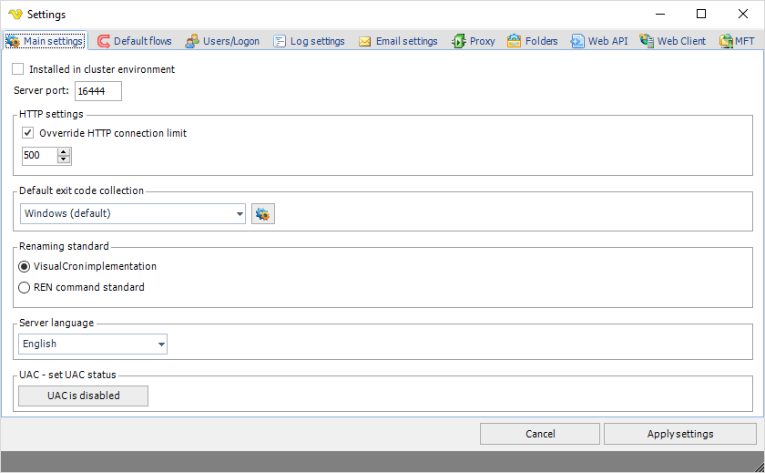

## Main - Settings

In the main menu **Server > Main settings > Settings** dialog, there are a set of important setting groups/tabs. See the following sub chapters for information about other tabs than Main settings:

* [Main - Settings - Users/Logon](../../client-user-interface/server/settings-users-logon)
* [Main - Settings - Log settings](../../client-user-interface/server/settings-log-settings)
* [Main - Settings - Email settings](../../client-user-interface/server/settings-email-settings)
* [Main - Settings - Proxy](../../client-user-interface/server/settings-proxy)
* [Main - Settings - Folders](../../client-user-interface/server/settings-folders)
* [Main - Settings - Web API](../../client-user-interface/server/settings-web-api)
* [Main - Settings - Web Client](../../client-user-interface/server/settings-web-client)
 
**Main > Settings > Main setting**s tab

**Installed in a cluster environment**

Check this if you are installing VisualCron (on two nodes) on a shared drive.
 
**Server port**

VisualCron sends encrypted information across the default TCP port 16444. If you want to change this port you enter a new integer value here.
 
**Override HTTP connection limit**

This general setting controls number of HTTP connections that can be done from VisualCron. Increasing this might be good if you plan to run many HTTP requests at once (for example through the HTTP Task).
 
**Default exit code collection**

This sets the default exit code collection that is pre-selected in On error tab of a Task.
 
**Renaming standard**

For various Tasks VisualCron offers "rename" of various strings. Depending on your requirements there are 2 different implementations. The REN command standard follows renaming conventions of REN command. As many of these conventions were not logical to us and our customers we implemented our own renaming standard - adjusting some of the standards of the REN command.
 
**Server language**

This controls the language used on the Server (when writing to logs etc).
 
**UAC - set UAC status**

This control the Local Security Policy settings "User Account Control: Turn on Admin Approval Mode" and affects Execute Task primarily. If you use the Execute Task along with a Credential and get error -1073741502 you should disabled this property and reboot after the change.
 
This policy setting controls the behavior of all User Account Control (UAC) policy settings for the computer. If you change this policy setting, you must reboot your computer. The options are:
* UAC is disabled: (Default) Admin Approval Mode and all related UAC policy settings are disabled. Note: If this policy setting is disabled, the Security Center notifies you that the overall security of the operating system has been reduced.
* UAC is enabled: Admin Approval Mode is enabled. This policy must be enabled and related UAC policy settings must also be set appropriately to allow the built-in Administrator account and all other users who are members of the Administrators group to run in Admin Approval Mode.
 
Alternatively you can edit the registry and set:
HKEY_LOCAL_MACHINE\SYSTEM\CurrentControlSet\Control\Windows\NoInteractiveServices to 0