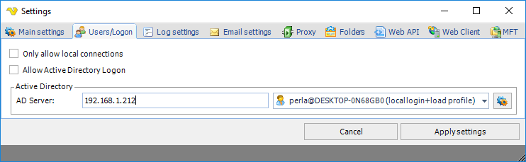
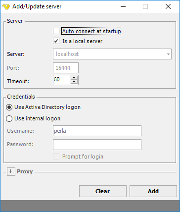
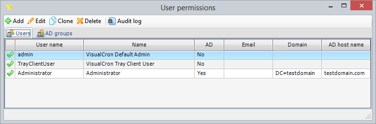
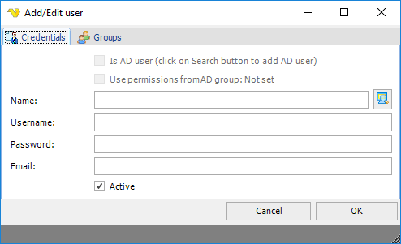
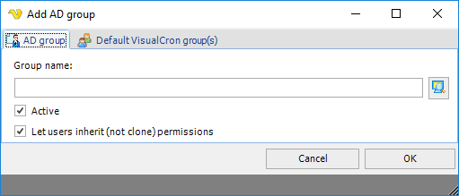
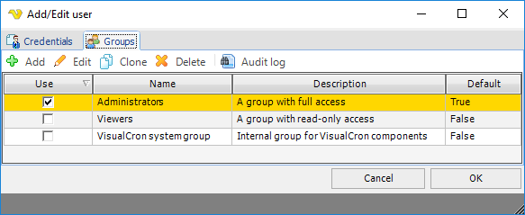
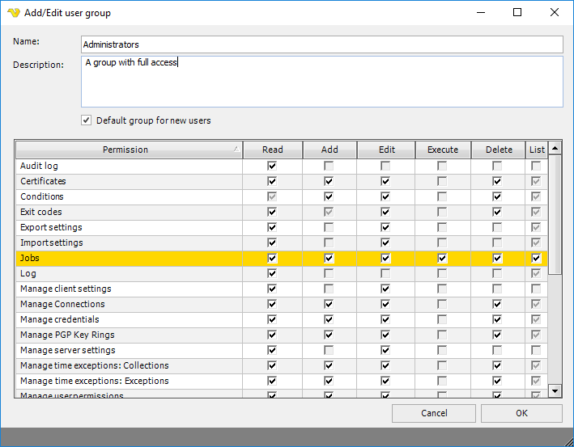

## Main - User Permissions

In the main menu **Server > Main settings > User permissions** dialog, user credentials for different items (Jobs, Tasks, Triggers, Notifications, Time exceptions, Client and Server settings, User administration, Log, and other objects) are handled.
 
VisualCron uses an internal system for authentication and granting permissions to different objects within VisualCron. The internal system can be extended with users or groups from Active directory to provide a more seamless login.
 
A user is a set of user name and password. A user can belong to one or more groups. The actual permissions is located in the group. By default, there is a "Administrators" group which can do everything. You can create your own group in order to manage detailed user permissions for this group.
 
**Active directory**

By default the internal system is used. To enable Active Directory support you need to enter Users/Logon settings.
 
**Server > Main settings > Settings > Users/Logon** tab

When creating the Server Connection you also need to check "Use Active Directory logon". This way you tell the Client to use AD user login method.

**File > Servers > Manage Servers > Add > AD**

The main dialog of the_ User permissions_ window lists all users and AD groups that are allowed to connect to this server. A user can be active (green check icon) or inactive (red cross icon). When active, the user is granted login with the predefined permissions.
 
The _Add, Edit, Clone_ or _Delete_ buttons are context sensitive to the tab you are in. Clone makes a shallow copy, a new user with the same permissions as the original user/group. If you want to add an AD group you need to select that tab and then click Add.
 
**Server > Main settings > User permissions**

When you add, edit or clone a user you are presented with the Add/Edit user window.
 
**Server > Main settings > User permissions > Users > Add > Credentials** tab

**Is AD user**

You can select users from the active directory by clicking on the Search button next to the Name.
 
**User permissions from AD Group**

It is possible to inherit the permissions from the Groups tab of the AD group. This is enabled by default if user is created from a group. If unchecked, the Groups tab, from the Add user window will be used instead of the settings from the AD group.
 
**Name**

This is the name that will be seen in the Manage users list, logs and "created by"/"modified by" in the Job list.
 
**Username**

This is the user name which is used at login.
 
**Password**

This is the password which is used at login.
 
**Email**

In a future version of VisualCron, the email field will be used for an administrator to send a reminder of the login credentials.
 
**Active**

If the current user is active or not (login enabled).

**Server > Main settings > User permissions > AD groups > Add** tab

**Group name**

The AD group name. This can not be altered manually - you need to search and select the group.
 
**Active**

If the current group is active or not (login enabled).
 
**Let users inherit (not clone) permissions**

Whenever an AD user logs on that belongs to an existing group the AD user is created in the AD user section. By default, there is a reference to the VisualCron group permissions from the AD group in the new AD user. But you can also uncheck this to be able to set specific group permissions after (so that it not references).
 
 
A user can belong to one or more groups. The groups contains the actual permissions. If a specific permission is requested and granted in any of users groups the user is granted to the specific permission.
 
**Server > Main settings > User permissions > Add > Groups tab**

**Server > Main settings > User permissions > Add > Groups > Edit** tab

**Name**

Name of the group.
 
**Default group for new users**

If this group should be the default group when a new user is created.
 
**Permission**

A permission can have the following attributes:
* "Read" - Allows the object to be viewed/showed in some way. This can be a window or a list
* "Add" - Allows the user to add and object to a list
* "Edit" - Allows the user to edit an object in a list or window
* "Delete" - Allows the user to delete an object from a list
* "Execute" - Allows the user to run/execute something
 
Not all permissions has, for obvious reasons, all attributes available. For example, permission "Log" can only be viewable or not and has, therefore, only the "Read" setting is available for change. When a setting cannot be changed for a permission it is grayed out/disabled.
 
For each permission, use the select boxes to update the valid attribute types. Your changes to a user will be saved when clicking OK.
 
See the list of all permissions with a description in the [Supported permissions](supportedpermissions) topic.
 
**Permissions**

**Manage Credentials**

* Read - Controls if the user can open the Manage Credentials window
* Add - Controls if the user can Add new Credentials
* Edit - Controls if the user can Edit existing Credentials
* Execute - Controls if a user can Execute a Task or similar with the selected Credential
* Delete - Controls if the user can Delete Credentials
 
 
**Overriding group permissions**

From VisualCron version 6.1.2. permissions can be overridden on Job level so you can set specific permission for a group on a specific Job. From version 8.4.2 you can override Credential permissions.