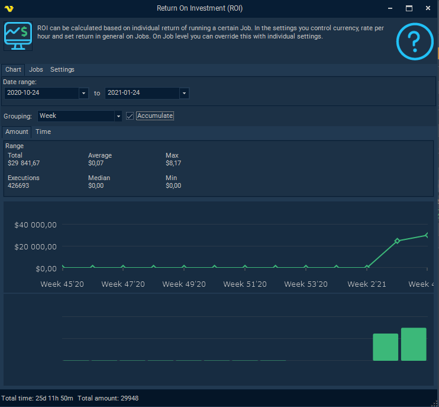
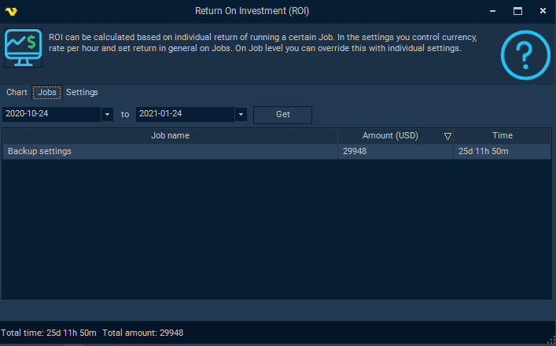
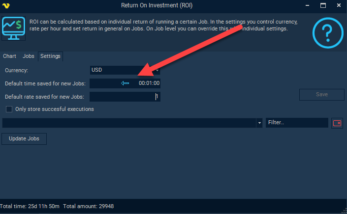

## ROI - Return On Investment

VisualCron is able to perform ROI - Return On Investments on the Jobs that are scheduled.
 
In VisualCron you can set a time value - how much time that Job saves you each time it runs - for example an hour. In combination you set an hourly rate - let say $50. This means that for each hour this Job returns $50 of the initial investment.
 
Currency, default time per Job and hourly rate per Job can be set generally in the Settings tab of the ROI window. It is possible to update all or selected Jobs with certain specific settings. It is also possible, on Job level, to [override this](job-main-settings).
 
### Chart tab

The chart time shows the combined ROI on all Jobs (that are have enabled ROI).
 
**Date range**

The default settings this window opens up with is current date minus 3 months.
 
**Grouping**

It is possible to group the chart in different intervals like Day, Week, Month, Year or no grouping at all.
 
**Accumulate**

Checking the Accumulate checkbox aggregates the data over time.

## Jobs tab

The Jobs tab shows a top list of total ROI per Job, default sorted on amount.

### Settings tab

In this tab you can set the default settings for all Jobs. Iit is possible to update all or selected Jobs with certain specific settings. It is also possible, on Job level, to [override this](job-main-settings).
 
**Currency**

The currency to be displayed in the application related to ROI.
 
**Default time saved for new Jobs**

Default time that will be used for new Jobs and existing one using default settings.
 
**Default rate saved for new Jobs**

Default hourly rate that will be used for new Jobs and existing Jobs using default settings.
 
**Update Jobs**

Updates selected Jobs with the default settings unless it has been overridden before.
 
**Save**

Saves the default server settings for ROI.

