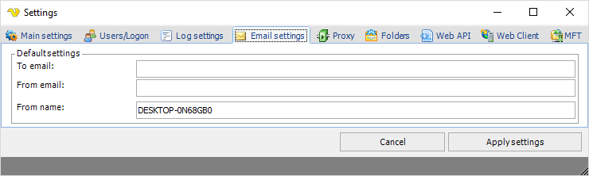

## Settings - Email Settings

In the main menu **Server > Main settings > Settings** dialog, there are a set of important setting groups/tabs. In this tab, the email settings are managed.
 
These are the default settings that will be used for the Email Tasks. The SMTP connection details are managed in the [Connections - SMTP Connection](../server/connection-smtp).
 
**Main > Settings > Email settings** tab

**To email**

By entering information in this field, the fields at Add Job, will be automatically entered. You can send to several email addresses at the same time by separating these with a semicolon (";"). The To email address(es) shall be a valid email address(es) to where the email(s) will be sent.
 
**From email**

By entering information in this field, the fields at Add Job, will be automatically entered. This is the default email address that VisualCron uses to send email from.
 
**From name**

The origin of the the email message. By default it is the server name.