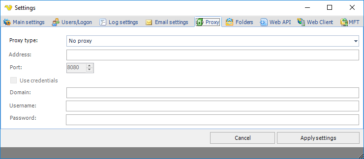

## Settings - Proxy

In the main menu **Server > Main settings > Settings** dialog, there are a set of important setting groups/tabs. In this tab, the proxy settings are managed.
 
**Main > Settings > Proxy** tab

**Proxy type**

Select the proxy type to be used.
 
**Address**

The host name or IP address of the proxy server.
 
**Port**

The port of the proxy server.
 
**Use credentials**

Text ...
 
**Domain**

The name of the domain to be used.
 
**Username**

The user name to access the proxy server.
 
**Password**

The password to access the proxy server.