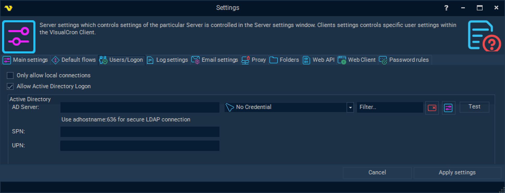

## Settings - Users/Logon

In the main menu S**erver > Main settings > Settings** dialog, there are a set of important setting groups/tabs. In this tab, the users and logon settings are managed.
 
**Main > Settings > Users/Logon** tab



**Only allow local connections**

This setting closes the remote port 16444 for incoming connections. Local login is only possible.
 
**Allow Active Directory logon**

VisualCron has two different authentication systems; one internal and one that is extended by Active Directory. This box needs to be checked in order to allow AD logon.
 
**AD Server**

When using Active Directory logon you need to specify server name or IP address. This will be used as default when working with [user permissions](../server/main-user-permissions).
Please add :636 to make secure LDAP connections, i.e. **adhostname:636**. Otherwise non-secure connection will be used.
The name of the AD server can also be specified in the extended format: HostName:PortNumber/DistinguishedName. For example: **contoso.com:636/DC=contoso,DC=com**
 
**Credential**

The AD Server Credential that will be used as default when working with [user permissions](../server/main-user-permissions).
 

## Test button

When the button is pressed, the availability of access to AD objects from the VisualCron Server is checked.
Access is required for further authorization of connecting AD users, in particular to verify the user's presence in AD and to obtain a list of AD groups to which the user belongs. The resulting list of groups is then used to determine the user's permissions according to the [settings(settings)].
 
**Additional testing**

If the Test button produces an unsuccessful result, and SSL is used (port 636 is specified), it is possible to activate an additional verification mechanism.
To do this, it is first advisable to enable [extended debug logging](../server/settings-log-settings), apply the settings, then open the Users/Logon tab again and specify the AD Server in the extended format: HostName:PortNumber/DistinguishedName (for example: contoso.com:636/DC=contoso,DC=com).
After testing, server log messages (starting with "GotADTest") will help determine the source of the problem.
 
 
**Users/Logon** 

screen also displays possible UPN / SPN values used to start the VisualCron Server and create secure endpoints for data exchange.
You can use those as hints setting up new Client connections.
 
**UPN**

The User Principal Name of the service account. The UPN is in the form username@domain. For example, when the service is running in a user account, it may be **```username@contoso.com```**
 
**SPN**

The Service Principal Name as the hostname part of the service endpoint address prefixed with the "host/" literal. SPN Principal Name might look like **HOST/serverDNSname.FQDN** or **serverDNSname.FQDN**.
In order to check for possible SPN values please run the following command setspn **-l serverDNSname** in Windows CommandLine utility.