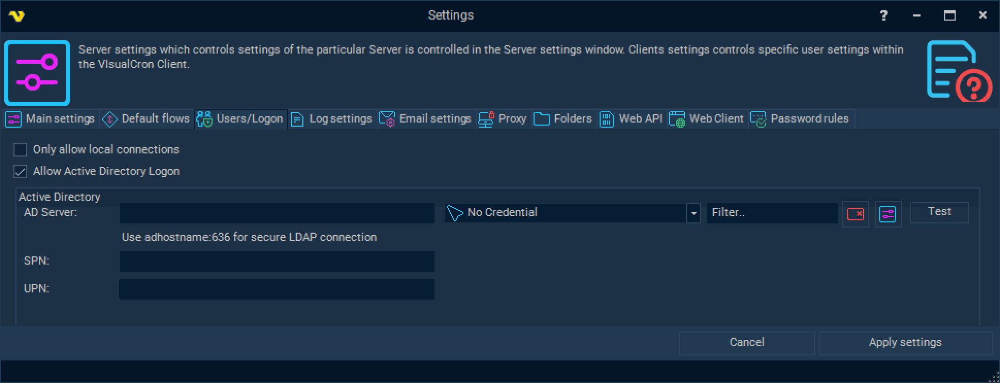

## Settings - Users/Logon

In the main menu S**erver > Main settings > Settings** dialog, there are a set of important setting groups/tabs. In this tab, the users and logon settings are managed.
 
**Main > Settings > Users/Logon** tab



**Only allow local connections**

This setting closes the remote port 16444 for incoming connections. Local login is only possible.
 
**Allow Active Directory logon**

VisualCron has two different authentication systems; one internal and one that is extended by Active Directory. This box needs to be checked in order to allow AD logon.
 
**AD Server**

When using Active Directory logon you need to specify server name or IP address. This will be used as default when working with [user permissions](../server/main-user-permissions).
Add :636 to make secure LDAP connections, for example **adhostname:636**. Otherwise a non-secure connection is used.
The name of the AD server can also be specified in the extended format: HostName:PortNumber/DistinguishedName. For example: **contoso.com:636/DC=contoso,DC=com**

Use a fully qualified domain name rather than a NetBIOS name or an IP address when Kerberos is required: no Kerberos ticket can be issued for a name that has no service principal.

:::caution

Do not combine an LDAPS port (636 or 3269) with **Force sealed connection**. A domain controller refuses to seal a connection that TLS already protects, so every logon bind would fail. Save and Test both refuse the combination. With sealing on, use port 389, or 3268 for the Global Catalog; sealing encrypts the traffic itself.

:::

**Credential**

The AD Server Credential that will be used as default when working with [user permissions](../server/main-user-permissions).

Leave it empty to bind as the account the VisualCron Service runs under, which for Local System is the computer account. Use this when the account you would otherwise enter here belongs to the Active Directory **Protected Users** group: such an account cannot authenticate over NTLM, and a lookup bound with it fails.

**Force sealed connection (requires Kerberos, no NTLM fallback)**

Off by default. When on, every Active Directory bind the Server makes with these settings requests sealing, which is only available over Kerberos. A bind that could only complete over NTLM is refused and logged with the reason, instead of silently downgrading. Turn it on when the domain enforces Kerberos, for example because accounts are in the **Protected Users** group, or when you want a misconfiguration to fail loudly.

The setting applies to the logon lookup, the Test button, the scheduled check of AD groups, and the **Find AD user** and **Find AD group** searches in [user permissions](../server/main-user-permissions). Those searches run on the Client computer, so a Client that can only reach the domain controller over NTLM gets an error where it used to succeed. The setting is only available while **Allow Active Directory logon** is on. A Client from an earlier release that saves these settings leaves the setting as it is on the Server.


## Test button

Press **Test** to check that the VisualCron Server can bind to the AD Server with the values currently on this tab, saved or not. Access is required to authorize connecting AD users: to verify that the user exists and to obtain the list of AD groups the user belongs to, which determines the user's permissions.

The Test binds the same way a logon does. It uses the **AD Server**, the first **Credential** in the list, and the **Force sealed connection** state as they are on the form. With no credential it binds as the account the VisualCron Service runs under. A failed Test shows the same explanation the Server writes to its log for a failed logon, naming the likely cause. The Test requires permission to edit Server Settings.

**Additional testing**

If the Test is unsuccessful, **Force sealed connection** is off, and an LDAPS port is used (636 or 3269), the Server also tries a direct LDAPS bind. To make use of this, first turn on [extended debug logging](../server/settings-log-settings), apply the settings, then open the Users/Logon tab again and specify the AD Server in the extended format HostName:PortNumber/DistinguishedName, for example contoso.com:636/DC=contoso,DC=com. Server log messages starting with "GotADTest" then help determine the source of the problem. This second bind does not run while **Force sealed connection** is on, because a logon has no such fallback.

 
**Users/Logon** 

screen also displays the UPN and SPN values the VisualCron Server derives for its own service account and uses to create its Windows-authentication endpoint.

Only one of the two applies, depending on the account the VisualCron Service runs under: the SPN when the service runs as Local System, the UPN when it runs as a domain user account. A Client connection set to the **Automatic** identity type derives the same SPN itself and, after one successful connection, remembers the UPN. You only need to copy a value from here when you select **UPN identity** or **SPN identity** explicitly. For how to enter it on the Client, see [manage servers](../file/manage-servers).

**UPN**

The User Principal Name of the service account. The UPN is in the form username@domain. For example, when the service is running in a user account, it may be **```username@contoso.com```**
 
**SPN**

The Service Principal Name: the fully qualified name of the Server computer prefixed with the `HOST/` service class, for example **HOST/server.contoso.com**. A bare host name without the `HOST/` prefix is not an SPN and cannot be used to obtain a Kerberos ticket. To list the SPNs registered for the Server computer, run `setspn -L <server name>` at a command prompt.
