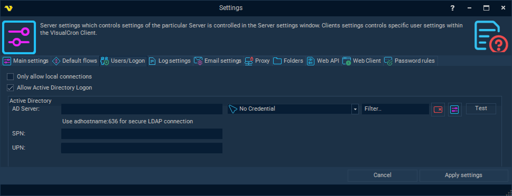

## Settings - Users/Logon

The **_Users/Logon_** tab of the Settings window controls where users can log on from, and whether they can log on with their Active Directory (AD) account. To open it, click **_Server_** -> _Main settings_ -> _Settings_, then select the **_Users/Logon_** tab. For users, groups and AD groups, see [Main - User Permissions](../server/main-user-permissions).

**Only allow local connections**

:::warning

This setting does not close the Server port (default "16444", set on the **_Main settings_** tab). The Server still accepts connections on it, and Web API connections are not refused at all.

To block remote access:

- close the Server port in the firewall
- clear _Allow Web API_ on the **_Web API_** tab, or close its ports in the firewall (see [Settings - Web API](../server/settings-web-api))

When you change the port, VisualCron moves its existing inbound firewall rule for the Server port, if there is one, to the new port. Check the firewall again after a port change.

:::

When checked, the Server refuses every logon on the Server port that comes from another computer. That includes the desktop Client, programs that use the VisualCron API, and a Web Client installed on another computer. Logons from the Server's own computer are allowed, including logons through a Web Client installed there. Web API logons are not refused. The check runs when the user logs on.

**Allow Active Directory Logon**

When checked, users can log on with their AD account. When cleared, every AD logon is refused, and only internal VisualCron users can log on.

_Test_ and _Force Windows Authentication_ (on the **_Web API_** tab) are available only while this box is checked. Clearing it also clears _Force Windows Authentication_.

**AD Server:**

:::warning

Without a secure port, the connection to the AD server is not encrypted. Add ":636" for secure LDAP, or ":3269" for the Global Catalog, for example `<host name>:636`.

:::

The Active Directory server to query, as a host name or IP address. It is used for AD logons, and when you search for AD users and groups (see [Main - User Permissions](../server/main-user-permissions)). If the field is empty when you open the tab, it is filled in with the domain or workgroup name of the computer the Client runs on.

You can also use the format `<host name>:<port>/<distinguished name>`, for example `<host name>:636/DC=<domain>,DC=<suffix>`.

**Credential**

The Credentials VisualCron uses to query Active Directory. Check one or more Credentials in the list:

- type in the _Filter.._ box to narrow the list. The button next to it clears the filter
- the last button opens the _Manage credentials_ window

If your users come from more than one domain, check one Credential per domain. VisualCron uses the Credential whose _Domain_ matches the domain it queries. If none matches, it uses the first Credential. See [Global - Credentials](../server/global-credentials).

### Test

Checks that the Server can reach Active Directory with the _AD Server:_ and Credential you entered. The Server needs this access to confirm that an AD user exists and to read the user's AD groups, which decide the user's permissions (see [Main - User Permissions](../server/main-user-permissions)).

_Test_ is available only while _Allow Active Directory Logon_ is checked, and it needs both an AD server and a Credential. The result is "Test successful", or "Test unsuccessful", sometimes followed by an error message.

#### When Test fails over secure LDAP

:::warning

The secure LDAP retry described here does not check the AD server's certificate. Rely on secure LDAP only when _Test_ succeeds without the retry. If only the retry succeeds, make the AD server's certificate trusted on the Server computer, and test again.

:::

If the first check stops with an error and _AD Server:_ uses the format `<host name>:636/<distinguished name>` (or port 3269), the Server retries over a direct secure LDAP connection. When the retry gives a result, _Test_ shows that result without an error message. The results mean:

- "Test successful": the first check, or the retry, succeeded
- "Test unsuccessful" with no error message: the first check, or the retry, ran without an error but did not succeed
- "Test unsuccessful" followed by an error: the first check stopped with an error, and the retry was not made or also stopped with an error

To find out which check gave the result, complete the following steps:

1. On the **_Log settings_** tab, check _Extended debug logging_, and click _Apply settings_ (see [Settings - Log Settings](../server/settings-log-settings)).
2. Open the **_Users/Logon_** tab again, and enter _AD Server:_ in the format above.
3. Click _Test_.
4. In the Server log, read the entries that start with "GotADTest". They are written only while _Extended debug logging_ is on.

The log then shows whether the retry ran and what it returned.

### SPN and UPN

On a computer joined to a domain, the Server also accepts Client connections that identify the Server by a Windows principal name. The tab shows the values a Client can use. Enter the one that applies in the _Add/Update server_ window (see [Servers - Manage Servers](../file/manage-servers)).

**SPN:**

The Service Principal Name: "HOST/" followed by the Server computer's DNS name, in the form `HOST/<server FQDN>`. Use it when the VisualCron service runs as Local System. To list the SPNs registered for the computer, run `setspn -l <server DNS name>` in a Windows command prompt.

**UPN:**

The User Principal Name of the account the VisualCron service runs under, in the form `<user name>@<domain>`. Use it when the service runs as a domain user account. When the service runs as Local System, it shows "NA".
