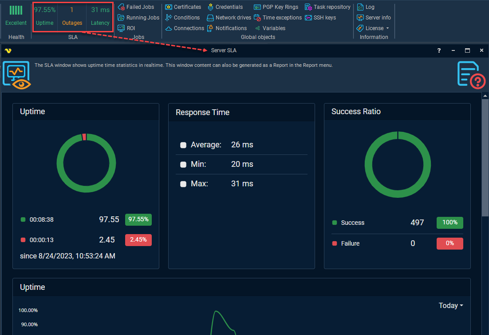

## SLA - Uptime, Outages, Latency

There are three interactive buttons in the main menu group **Server > SLA**:
 
**Uptime** _(%)_

Server uptime in the last 24 hours as a percentage.
 
**Outages** _(amount)_

Server outages number (how many times the server was stopped) in the last 24 hours.
 
**Latency** _(ms)_

Maximum Server ping response time (in ms) in the last minute (if there is no recent statistics, the last obtained value is kept).
 
 
Clicking on any of these buttons opens an interactive report:
**Server > SLA > Server SLA** (report with realtime updates)

**Usage in Load Balancer**
 
Server metrics like Uptime and Latency are also available as Load balancing Conditions: "Daily Server uptime (%)" and "Maximum response time (ms)".
See the [Load balancing Flows](../servers/load-balancing-flows) topic for information on how to use Load balancing Flows and how to set up various Conditions for them.