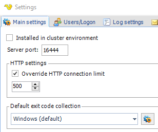
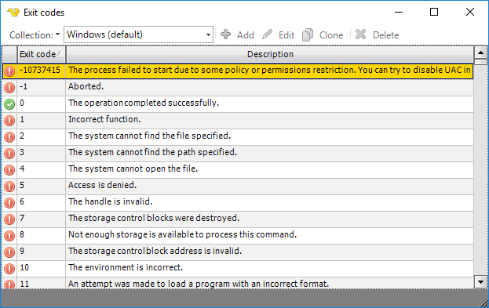

## Task - Exit Code Collection

Exit codes controls the result of the Task. By default, the Windows exit code scheme is used which basically means that 0 is success and the rest are errors defined in Windows by Microsoft. It is possible to create your own collection of exit codes/descriptions thus controlling which exit code is success or not.
 
There are a couple of settings that affects exit code collections:

1. **Task > On error** tab. Here you select which exit code collection should be used in the specific Task. Clicking on the button results in opening the specific exit code collection (see note 3 below).
 
2. **Server > Main settings** tab. Here you can control which exit code collection that should be used for new Tasks. Click the Setting icon to open the specific exit code collection (see note 3 below).

3. **Server > Main settings > Default exit code collection > Settings** icon. Editing exit code collections. Here you can switch between existing collections and create, edit, clone and delete exit codes. You can also edit individual exit codes by double clicking on a row.

