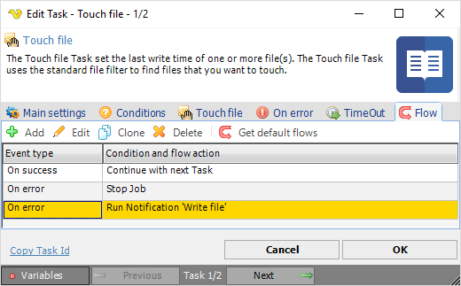
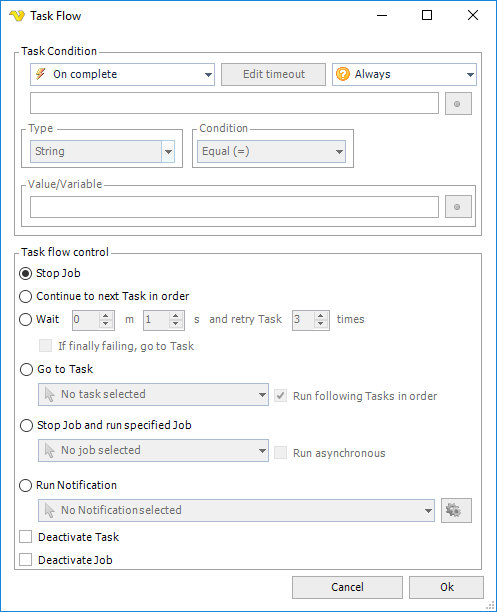

## Task - Flow

The Task Flow controls what happens at start, complete, success and failure of a Task with additional conditions based on output, exit code etc. One or more Flows can be created depending on how you want to control the Flow in various situations.
 
This feature was introduced with version 7.0.0 and replaced existing Notifications tab.
 
**Add/Edit Task > Flow** tab

The main listing above contains a verbose description of when (On error/On success/On complete) and what happens - the flow action.
 
If a new default flow is also desired for a previously defined Task, you need to click the *Get default flows* icon for each Task flow you want the default flow for. For more information about Default flows, see [Server > Settings > Default flows](settings-default-flows).
 
**Add/Edit Task > Flow > Add/Edit** tab

The Task Flow window is divided into two parts:

* Task Condition
* Task flow control
 
**Task Condition**

The Task Condition controls when and with what conditions the flow should be started.
 
**Event type**

* *On start* - performs the action at start (before Task is running)
* *On error* - performs the action when the Task has failed
* *On success* - performs the action when the Task returns success result
* *On complete* - performs the action when the Task completes - regardless of result
* *On running longer than* - performs the action if the Task runs longer than specified time
 
**On running longer than**

This option lets you control what happens if the Task run longer than a specified time. Click on the Edit timeout to specify the time.
 
**Event condition**

Event conditions contains some basic conditions that are optionally evaluated when the event type is matched. If you do not want to use any conditions you set it to the "Always" which means that the flow will continue whenever the event has been raised.

* Always - will continue without evaluating any condition
* If output - matches a value you enter with output of the Task
* If error output - matches a value you enter with output (err) of the Task
* If other value - If other value/Variable - matches any two values - could be two Variables or a mix. Click the Variables icon to open the Variables list.
* If exit code - matches a value with the exit code of the Task
 
**Type/Condition**

When you have selected an event condition you decide how to match this condition - with what value and data type. As for the condition, you can select from Equal, Not equal, Contains and Not contains.
 
**Value/Variable**

Enter a value or click the *Variables* icon to open the Variables list.
 
**Task Flow control**

The flow control group controls the action when the Task Condition has been matched with event and condition.
(Before version 7.0.0. these settings were presented in the **On error** tab)
 
**Stop Job**

Stops the Job execution immediately. No further Tasks will be run.
 
**Continue to next Task in order**

Ignores the error and continue to the following Task.
 
**Wait and retry**

Waits a specified time and then try to run the Task again. You can choose how many times VisualCron will try to do this before stopping the Job completely. Optionally you can check "If finally failing - goto Task" to set it to continue with other Task if it has failed for all specified retry times.
 
**Go to Task**

Runs a specified Task in the same Job. You also have option to continue running the following Tasks in order - after that Task.
 
**Run following Tasks in order**

The default behavior which means that it will run all Tasks defined after this Task. If you only want it to run the specified Task then uncheck this option.
 
**Stop Job and run specified Job**

Stops the current Job and executes another Job.
 
**Run Notification**

Runs the specified Notification. Click the Settings icon to populate the drop-down list of existing Notifications.
 
**Deactivate Task**

Deactivates the current Task.
 
**Deactivate Job**

Deactivates the current Job.