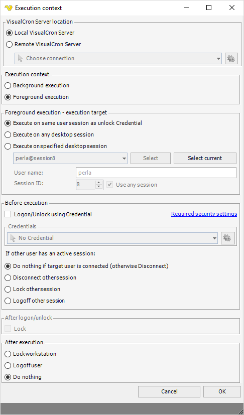

## Task Main Settings - Execution Context

The execution context sets in what environment/context the Task should be run. VisualCron offers two different kind of execution contexts, background or foreground execution.
 
**Background execution (default)**

Background execution is default. When a Task executes in the background it is run from the VisualCron Server service. This allows execution when no one is logged on to the computer. This option is the most efficient way of executing in VisualCron. The problems you may face with this option are that some Tasks require certain Credentials, access environment variables, drive mappings or desktop access (can't access or wrong desktop).
 
Credentials. To solve the problem where a certain user is needed to run a Task, we use [Credentials](../server/global-credentials) in VisualCron. Almost anywhere you can use Credentials for accessing a file or executing a Task as a certain user.
 
Environment variables. Environment variables are loaded when you load a user profile. If you want to access those you need to specify a Credential in an [Execute Task](../server/job-tasks-task-process-execute) and then select option Load profile.
 
Network drives. Normally, you should use UNC (`\\servername\path\file`) paths together with Credentials instead of mapping network drives. Network drives are not shared across users and since VisualCron is running as SYSTEM it can't see the drives mapped by a certain user. By specifying a UNC path instead you are sure that a logical drive is not removed etc. If you really need to work with Network drives you should use the [mapping utility](../server/global-network-drives) within VisualCron. It allows you to map the same network drives in SYSTEM context that you have in your USER context.
 
Desktop access. Starting with Windows Vista, security has changed. For example, services are no longer allowed to launch applications with Interactive content (a window). The reason for this is that you can break the application anytime and get Administrator access. This is correct from a security perspective and to handle this you can launch your applications in hidden mode (hidden property in Execute Task). If you for some reason need to interact with other windows you can use the Foreground execution.
 
**Foreground execution**

Foreground execution is handled by the [VisualCron Tray Client](../../using-visualcron/visualcron-tray-client).
 
When using foreground execution you use a selected session to execute as. This means, that you are able to get access to the desktop and same variables, network drives etc. as when you normally run a command from the DOS prompt. Use foreground execution when you want to access a specific window.
 
This feature is implemented in the following Task(s):

* [Process - Execute](job-tasks-task-process-execute)
* [System - Control monitor](../server/job-tasks/system-tasks/control-monitor)
* [Interactivity - Desktop macro](../server/job-tasks/interactivity-tasks/desktop-macro)
* [Interactivity - Robot](../server/job-tasks/interactivity-tasks/robot-task)
* [Interactivity - Send keys](../server/job-tasks/interactivity-tasks/send-keys)
 
Instead of executing a file from the Windows service VisualCronService.exe we are executing through the VisualCron Tray Client. This requires that the proper Tray Client session that you specify in the Execution Context window is connected to the VisualCron service. The Tray Client is automatically started when a user logs in.
 
If a specified Tray Client session is logged in, the VisualCron Server sends a command to the Tray Client. The Tray Client then executes and reports back to the Service which in turn reports back to all connected VisualCron clients.
 
In the Execution context window (which you reach from [main Task window](../server/job-tasks)) you set the execution context parameters.
 
**Task > Main settings > Execution** context

**VisualCron Server location**

Some Tasks (currently only Execute Task) allows execution on the local machine but also remote VisualCron Server. Select a VisualCron Connection to execute the Task on a remote VisualCron Server. Please note that VisualCron needs to be installed in the remote location.
 
**Background/Foreground execution**

Background execution is default and requires no logged in Tray Client. When choosing Foreground execution you get a set of extra parameters.
 
**Execution target**

You can choose to *Execute on any desktop sessions* - this executes on the first available session. By default you can *Execute on same user session as unlock Credential* - this means that VisualCron will launch the process on the same user that is set in Before execution.
 
You can also choose to Execute on specified desktop session. You can  choose from the list of connected sessions and click *Select*. If you are locally connected you can also click on *Select current* which retrieves information about your session.
 
**User name**

The user that you want to execute as / use the session from.
 
**Session ID**

One user can be connected to several sessions. You can either accept to Use any session or specify a selected session.
 
:::info Note

If you are not executing on the same user and session as you have selected you will not see interface/window of the process you started.

:::

:::info Note 

For Windows 2008 you must enable a setting in [Local Security Policy](../../security)

:::

**Before execution**

The [VisualCron Tray Client](../../using-visualcron/visualcron-tray-client) needs to be running in order to execute a foreground Task. If no one is logged in the desktop is not active and no Tray Client is started. There is also a scenario when the computer may be locked. This prevents Tasks that need access to desktop (for example the [Desktop Macro Task](../server/job-tasks/interactivity-tasks/desktop-macro)) to be able to run. The solution to that is to tell VisualCron to perform a logon/unlock. If the computer is locked VisualCron will try to unlock. If no user is logged in VisualCron will logon. You need to check Logon/Unlock using Credential and specify a Credential. Note that the Credential must match the desktop session (if you are not using Execute on any desktop session).
 
If multiple users are logged in at the same time you need to handle this as only one user can be active. There are 3 options for this:

1. Disconnect - disconnects the session for other user

2. Lock - locks the computer of the active session (however only the person who locked can unlock)

3. Logoff - signs out the other user (current applications will be closed)
 
**After logon/unlock**

You can choose that VisualCron should automatically lock after logon. This could be interesting if you want access to the desktop environment but to keep security (desktop locked). When checking Lock VisualCron will lock after a successful login.
 
**After execution**

You may want to "close" after yourself. Lock or logoff current user. Select Do nothing if you want to keep the desktop open.
 
### Troubleshooting
 
Failed to connect to Credential Provider. Pipe result: 0

1. Make sure you have tried rebooting after the VisualCron install - this installs the the Credential provider properly

2. Make sure you have enabled [this setting](../../security#interactive-logon) in the Local Security Policy

3. Test with recommended settings "Execute on same user as unlock Credential" and check "Logon/Unlock using Credential". Select the Credential you want to logon as (recommended is that it is same user as you normally is logged in as)

4. Test the Credential in Manage Credentials->Edit->Test. Make sure that Local login and Load profile is checked before testing. If it does not work it might be something with password or username.

5. If it still does not work then enable Extended debugging in Server settings->Log. Try to run the Job manually. Send the files server_startup.txt together with log_serverDATE.txt to support@visualcron.com