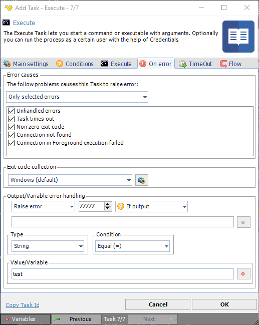

## Task - On Error

The **On error** tab in the Task window controls what is causing an error in VisualCron. Compare this with [Task Flow](task-flow) which controls what happens when a Task completes.
 
**Add/Edit Task > On error** tab

**Error causes**

Different Task types have different reasons to fail. The goal is that you should be able to control what actually is considered an error by you - for all kinds of Tasks. We have not implemented handling for all kinds of errors but if you request handling for a specific error, in our request forum, we will add that.
 
**Error cause categories**

VisualCron evaluates a set of different error categories that will trigger the Task into error state:

* "All errors" - all kinds of errors raise a Task error

* "Only selected errors" - only items that you select in the list raises a Task error

* "All except selected" - only items that you have not select in the list raises a Task error
 
**Exit code collection**

Exit codes controls the result of the Task. By default we are using the Windows exit code scheme which basically means that 0 is success and the rest are errors defined in Windows by Microsoft. It is possible to create your own collection of exit codes and control which exit code is success or not and its description. Read more about this [here](task-exit-code-collection).
 
**Output/Variable error handling**

It is possible to control if the Task should raise an error based on output, output (err) and any Variable/value that matches a certain condition at runtime. It is also possible to do the opposite, override an error based on these conditions.
 
**Raise error**

**Not set** 

Default setting which means that there will be no other error handling than the "Error cause" on top of **On error** tab.

**Raise error** 

This means that if the conditions below match any success of Task will be overridden with an error and specified exit code.

**Do not raise error** 

This means that if the conditions below match any failure of Task will be overridden with success and the specified exit code.
 
**Exit code**

This exit code overrides the current exit code when the condition is matched. The default value is 77777.
 
**Check type**

You can choose to check output (std), output (err) or evaluate a Variable/value in real time. When evaluating a Variable/value use both the first and second text field.
 
**Type**

This controls with what data type the comparison is made.
 
**Condition**

This is the type of condition that it is trying to match on; Equal, Contains, Not equal etc.
 
**Value/Variable**

This is the field where you enter the value you want to match the condition with. Click the Variables icon to open the Variables list.