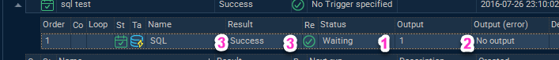
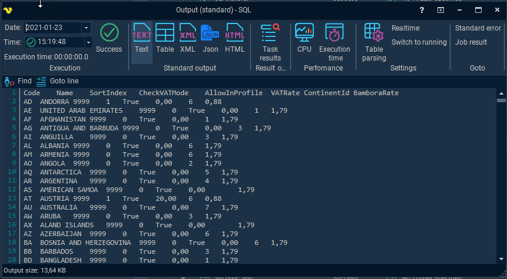
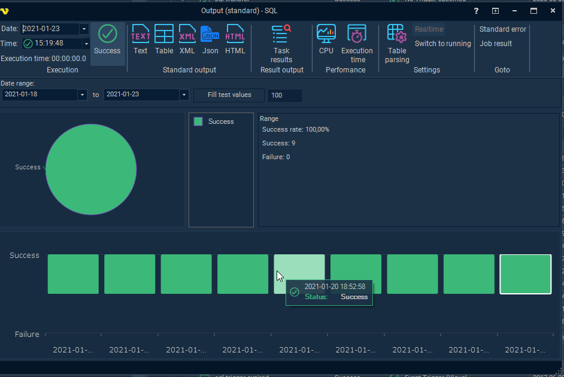
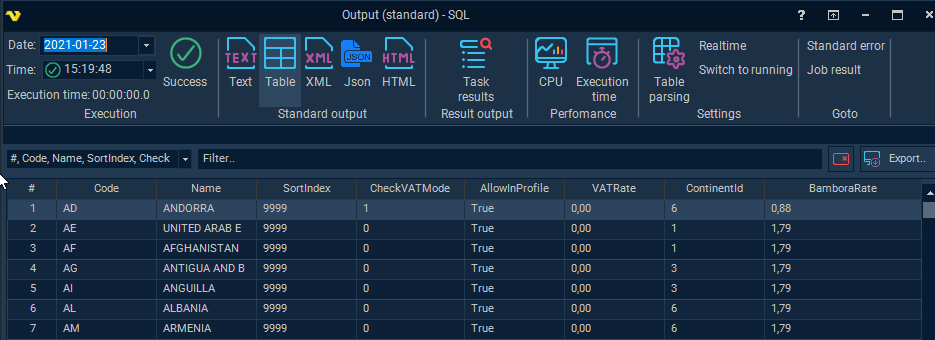
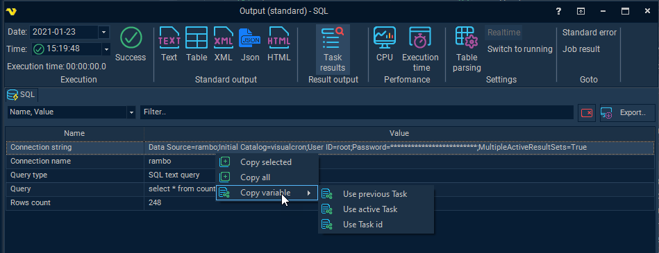
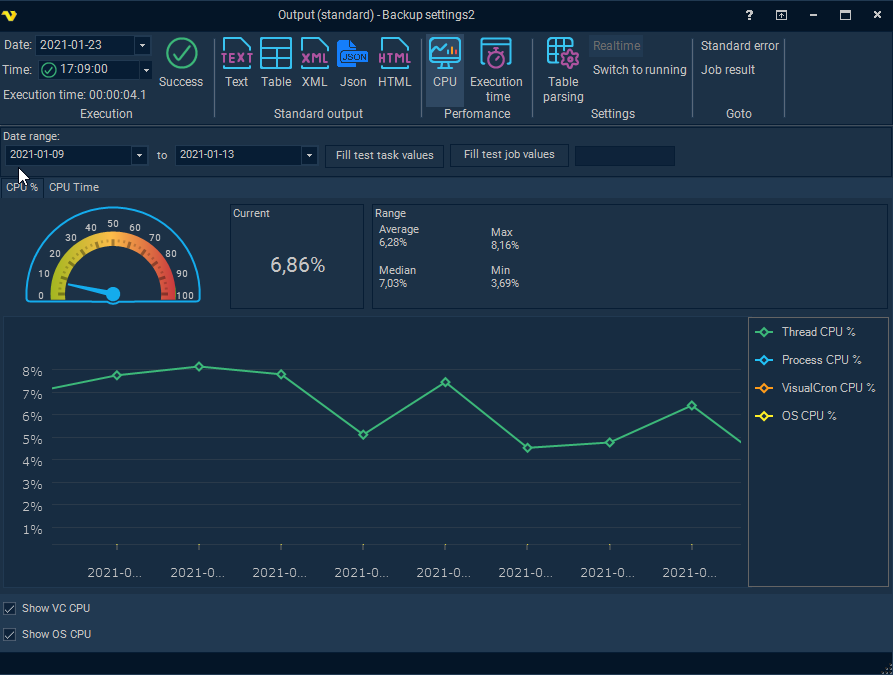
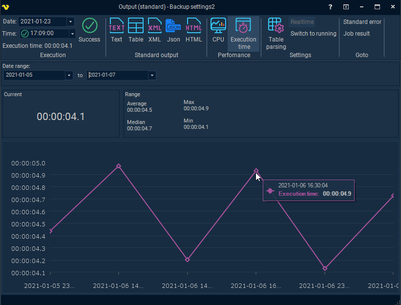
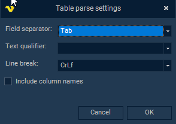
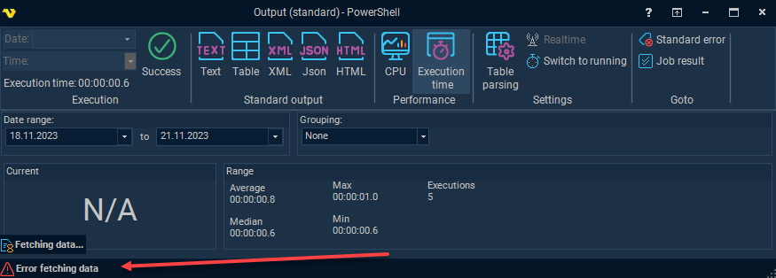

## Task - Output and Result

The output window show information and result from the Task. The following information is collected:
 
* Output
* Task result (specific Task information i.e. which command line was used in Execute Task or a video of Robot Task)
* CPU usage
* Execution result (Success/Failure)
* Execution time
 
**Task result**

Task result is specific for each Task. Depending on the result type we display it differently. It could be a table, image or video. We continue to add more result based on request but here are some examples of Tasks and their result;
 
* Execute Task - Command line, Arguments, Process Id
* SQL Task - Connection string, Connection name, Query type, Query, Rows count
* Web macro Task - Video or Images of the playback
* Robot Task - Video of the playback
* Etc.
 
You may be able to increase output details by checking Extra Task debugging in Main settings of the Task.
 
**Accessing Output and Result**

Depending on where you double click on the Task row the output window is opened but the focus depends on where you double click:
 
1. Show the output - double click on "Output"

2. Show the error output - double click on "Output (error)"

3. Show the result - double click on Result (success/failure) column or the success/failure icon.

4. You can also right click on a Task and select Result->Task result

**Output and Result window**

**Find**

Searches within the output.
 
**Goto line**

Scrolls down to a specific line in the output.
 
**Get full output**

This requests the full output from the server. By default only 2000 characters are loaded by default.
 
 
### Execution
 
**Date of execution**

In the date picker you select which day you would like to view output/results from. The amount of data stored is determined by the database log settings in [server settings](settings-log-settings). In the date picker you can see available dates where you have at least one execution. Whenever you select a date the available times the Task has been executed is listed in the Time selection box under.
 
**Execution time**

This is based on the Date of execution selection. In front of the time you see the result of the Task - if it was a success or failure.
 
**Time of execution**

This is the total time the Task ran.
 
**Success/Failure button**

Clicking this button show charts and statistics related to execution result.It is possible to control the range of executions. Success is marked in green and Failure in red. It is possible to zoom in and out in chart holding CTRL+Scroll wheel.

**Standard and error output**
 
There are different types of output representation depending on Task type. You can switch between error and standard output with in the Goto ribbon group. This is also context sensitive to if you double clicked on the Standard output or Standard error column from the beginning.
 
* Text - this is the raw text format.
* XML - this is simply trying to represent the raw text output in XML format styling
* JSON - this is trying to represent the raw text output in JSON format styling
* HTML - this is trying to represent the raw text output in HTML format styling
* Table - this is converting the result to a table. Might be useful for viewing Tasks like the SQL Task. With the table you you have filters and export functionality. Sometimes, the way this data is parsed depends on the *Table parsing settings* in output window  in combination with the output settings tab in the Task.

**Task results**
 
This is Task specific and showing a combination of Task specific settings that were used during runtime (that could be interesting to view later) and actual result from the Task. It is possible to export these values and filter them. This is also a way to finding the right Variable - if you want to use the value in a follow up Task or Notification for example. To get the right [Variable](global-variables) you can right click on the row and select the appropriate [Variable](global-variables) type.
 
The Task results button is only visible if the Task in question has specific Task result values.

**Performance->CPU**
 
The CPU chart displays the CPU usage for each execution. These are approximate values VisualCron calculate and log during execution to see the cost of the CPU usage during different operations. The information can be used to schedule Jobs and Tasks during different hours - to spread the CPU load.
 
There are two main views:
 
* CPU % - this is a % being used during the execution time period
* CPU Time - this is the cost value for the CPU during the execution time period
 
The CPU % usage is separted 4 categories:
 
* Thread CPU - how much CPU % is consumed by the Task internally in VisualCron
* Process CPU - how much CPU % is consumed by any process related to the Task. For example, the PowerShell Task uses an external process or execution.
* VisualCron CPU - how much CPU % consumed by VisualCron Server during that time. This way general usage can be compared  (can be optionally compared with checkbox)
* OS CPU - how much CPU % the operating system is using at that moment (can be optionally compared with checkbox)
 
The CPU time usage is separated into 2 categories:
 
* Thread CPU - how much CPU time is consumed by the Task internally in VisualCron
* Process CPU - how much CPU time is consumed by any process related to the Task. For example, the PowerShell Task uses an external process or execution.
 
There is a chart showing the latest value which is based on the selection Date + Time in the top left window. The data range defines the period being used for the line chart and the range values - this is controlled by the date range controls. It is possible to zoom with the mouse wheel and mark certain areas.

**Performance->Execution time**
 
The Execution time is how long it takes for a Task to complete. This is affected by the CPU load and the amount of data being processed and the delay in any external service. The charts help VisualCron users to get an overview, over time, how long time it takes for a specific operation.
 
The date range controls the line chart and range values. The current value is controlled by the selected Date + Time in the top left window.

### Settings
 
**Table parsing**

Sometimes, the way this data is parsed depends on the *Table parsing settings* in output window  in combination with the output settings tab in the Task. For example, in order to view SQL Task in Table mode the output of the SQL Task must match the Table parse settings. The *Table parse settings* can be altered and then a switch to *Output->Table* can be made to be able to create a table out of the data.

**Realtime**

By clicking on Realtime output button the output window is updated in realtime instead of when the Task has finished. Before clicking on realtime output the previous output is shown. Realtime button is only enabled for Task that supports realtime.
 
 
The following Task types support real time output:
 
* Execute Task
* PowerShell Task
* .NET Execute Task
* SSISDB Task
* SSIS Tasks
* DTS Tasks
* FTP/SFTP/SCP Tasks
* Copy files / sync files
* Cloud Tasks
* HTTP Task
* Web macro
 
**Switch to running**

When opening the output/result window it shows the last execution. If the Task starts after that it is possible to switch to that new execution by clicking Switch to running. This button is a state button which means that it will, once enabled, automatically switch to the latest running Task (that is opened).
 
### Goto
 
**Standard Error/Standard output**

Switches output between standard error and standard output.
 
**Job result**

Closes the Task window and open the [Job result](job-result) for the parent Job.
 
 
:::info Note
 
While downloading data from the VisualCron Server, the current download status is displayed in the status bar below: "Fetching data..."

If an error occurs in loading data, or if the Server does not return a response within the timeout configured in the connection to the Server, the status bar will display “Error fetching data”.
In such a situation, it is recommended to enable extended debug logging in the [Server settings](settings-log-settings), and then check the messages in the [Server and API logs](settings-log-settings).

:::