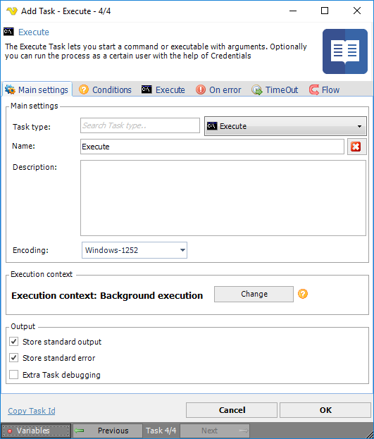

## Task - Task Type

Based on the selected Task type in the Task > Main settings tab, this tab reflects the current Task type selection and provides additional specific Task type settings. See the specific Task type under the [Task - Main settings](job-tasks-task-main-settings) chapter for more details.

