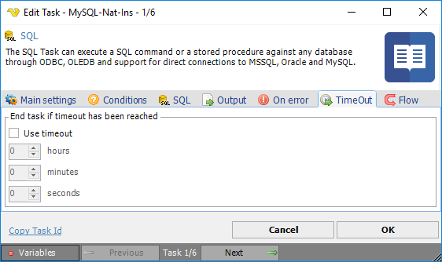

## Task - Timeout

Timeout is a way to abort an action that didn't run as expected, typically a connection or a response that doesn't happen within a reasonable time interval.
 
The timeout value can be set both at Task and Job level.
 
**Add/Edit Task > Timeout** tab

When the timeout is activated, all processes related the current Task will be terminated.

