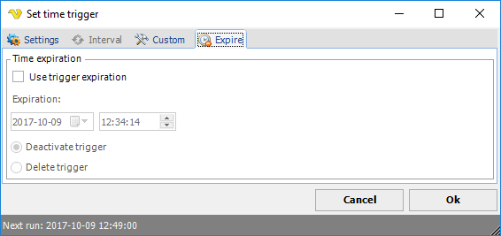

## Time  Trigger - Expiration

Set date and time when the time/event trigger should be removed.
 
There are two kinds of expiration modes:

* **Expire** - the trigger will still remain in the Job but is inactive and cannot be triggered until it is set to active again
* **Delete trigger** - the trigger will be deleted from the Job and will never be seen again