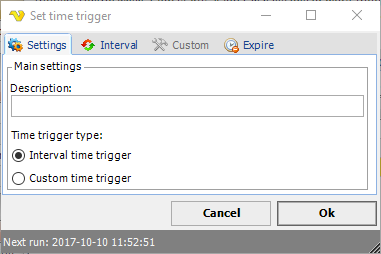

## Time Triggers

For Time trigger select one of _Interval_ or _Custom_ types.
 
**Job > Triggers > Add > Time trigger > Interval/Custom**

**Settings tab**

Enter a description which will distinguish several triggers from each other in a trigger list. You can also choose between the [Interval Time Trigger](interval-time-trigger) and [Custom Time Trigger](custom-time-trigger) type triggers. One trigger type is always selected and the other option will be grayed out.
 
**Interval tab**

This time trigger is a simplified Custom time trigger. Different Interval options are available.
 
**Custom tab**

The Custom time trigger also allows setting of time details when a Job should be triggered.
 
**Expire tab**

The expiration date/time for the time trigger may be set. Also the handling (Deactivate/Delete trigger) of the expired trigger is selected.