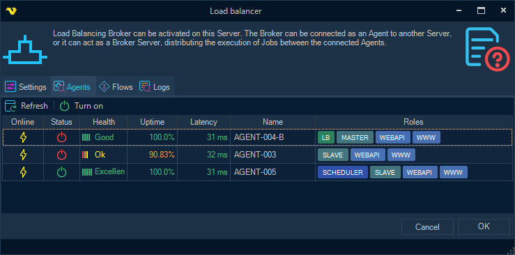
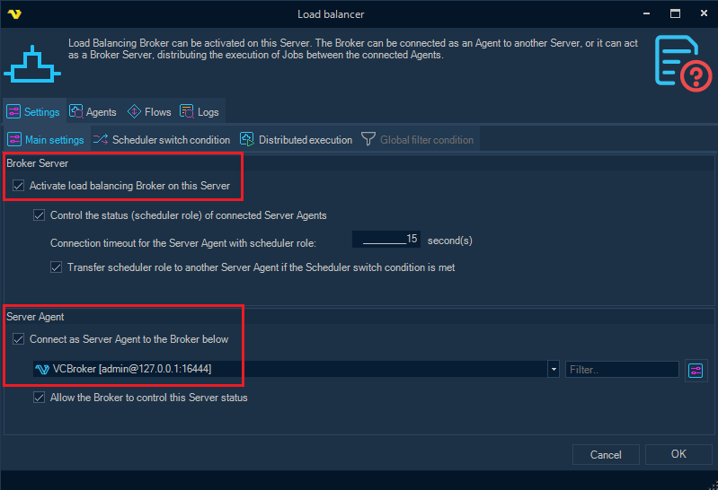
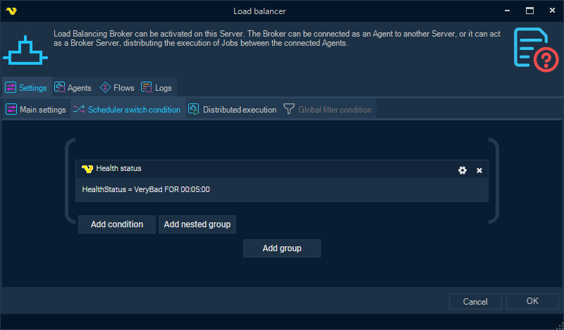
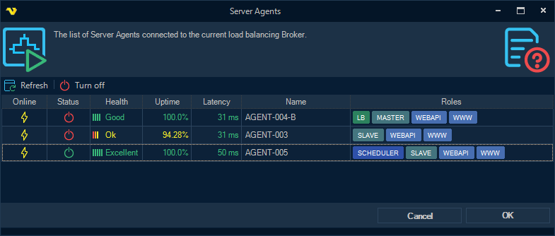

## Broker Server

**Broker Server** (Broker for short) - acts as a link between several VisualCron Servers, called Server Agents (hereinafter either Server or Agent for short).
 
Broker collects statistics from all connected Agents, sends different actions to the Agents for execution (e.g. execution of a certain Job), and most importantly: the Broker determines which of the controlled Agents should have the Scheduler role, i.e. start and monitor events of different Triggers.
Broker itself can run on any VisualCron Server, including a separate dedicated Server that does not additionally act as a Scheduler or Server Agent.

There are three main functions of the Broker:

* Collecting statistics from connected Servers
* Distributed Execution of Jobs
* Managing status of connected Servers
 
### Collecting statistics from connected Servers

Collected statistics can be used in three different scenarios:

* to filter Servers on which Job can be executed with the configured [distributed execution](execution-distribution) mode;
* when checking compliance with the Condition configured in the [Load balancing Flow](load-balancing-flows), for launching certain Actions;
* when checking the [Switching Condition](#scheduler-switch-condition) when the current Server with the Scheduler role is to be replaced by another connected Server.
 
### Distributed Execution of Jobs

If distributed execution is configured for a Job, instead of launching the Job locally, the Server creates and sends an execution request to the Broker. The Broker combines the parameters of distributed execution of the Job with the parameters of Server selection for execution, and then sends execution requests to the selected Servers.
See the [Execution Distribution](execution-distribution) topic for more details.
 
### Managing status of connected Servers

The essence of load balancing on the Broker's side is to choose among all connected Server Agents the one that will monitor the status of Triggers, and execute triggered Jobs – so called **Scheduler Agent**.
Agents other than the Scheduler are in the Off state (Spare Agents), i.e. they do not run or monitor triggers, although they can perform any task from the Broker, including the execution of a specific Job.
 
Note: the Broker controls the status only of those Agents that are connected in the appropriate mode (controlled by the Broker).
 
For more details, see the [Scheduler monitoring and controlling](#scheduler-monitoring-and-controlling) chapter below.
 
 
### Enabling Broker and connecting Server Agents
 
Configuration of the Broker and Server Agents is performed in the Load balancer settings form, available from main menu: **Servers** tab > **Execution distribution** group > **Load balancer**.

Broker Server must be activated on one of the VisualCron Servers ("*Activate load balancing Broker on this Server*" checkbox in the "*Broker Server*" group).
For other Servers, the connection to the Broker must be configured in the "*Server Agent*" group.
 
Note: it is recommended to set up object synchronization between the Servers in advance (menu: **Servers > Synchronization settings > Server object synchronization**).
 
### Configuring Scheduler control mode

For the Broker to control the status of the connected Servers, the "*Control the status of connected Server Agents*" checkbox must be activated in the Broker settings. It is also required to activate the "*Allow the Broker to control this Server status*" checkbox in the settings of each of the Servers that are to be controlled by the Broker.
If among the currently connected and monitored Servers there are none with the Scheduler role, the Broker will automatically select the Server that will become the Scheduler Agent after the configured timeout expires.
 
**Scheduler connection timeout**

Timeout is configured in the field "*Connection timeout for the Server Agent with scheduler role*", the default value is 15 seconds.
 
### Scheduler switch condition

With the checkbox "*Transfer scheduler role to another Server Agent if the Scheduler switch condition is met*" the user can additionally configure the switching condition (on the "*Scheduler switch condition*" tab).
Once the switching condition is met for the current Scheduler Agent, the Broker will try to switch the Scheduler role to another (spare) Agent.
 
An example of a switch condition is “Server Health is [Very bad] for 5 minutes”:

See the [Load balancing Conditions](load-balancing-conditions) topic for information on configuring load balancing conditions, as well as supported scheduler switch conditions.
 
### Scheduler monitoring and controlling
 
The user can monitor and control the status of connected Servers both on the “Agents” tab in the Load balancer settings form, and in the separate **Server Agents** form, accessible from the main menu (in the **Servers > Execution distribution** group).

The Scheduler role can be pre-configured on one of the connected Servers. Actually, one Server (Scheduler Agent) should have status ON, the rest should be with the status OFF (Spare Agents).
Further, the Broker controls the Scheduler role among the connected Servers in accordance with the established algorithm.
 
### Scheduler role control algorithm
 
*Case 1. No Scheduler Agent is detected*

(corresponding Server was disconnected, or its status became OFF, or the "Allow the Broker to control this Server status" checkbox was cleared)
 
* the Broker waits for the Scheduler Agent to connect within the configured timeout;
* if there is no connection, the Broker attempts to select a new Scheduler Agent among the connected Spare Agents;
* the Agent with the best Server Health is selected and, if possible, the switching condition should not be met for it;
* if an Agent has been selected, the Broker sends a request to it to turn on the Scheduler role.
 
*Case 2. Scheduler switch condition is met for the current Scheduler Agent* 

* the Broker attempts to select a new Scheduler Agent among the connected Spare Agents;
* but it does not take into account Agents for which the Scheduler switch condition is also met;
* if the new Scheduler Agent is selected, the Broker sends successive requests to turn off the old Agent and turn on the chosen one.
 
*Case 3. Two Scheduler Agents are detected connected at the same time*
 
* the Broker chooses among them the Agent for which the switching condition is not met, then the Agent with better Server Health;
* the chosen Agent remains, and the Broker sends to the second Agent a request to turn off the Scheduler role.
 
*Case 4. User sends a manual "Turn on" request from the "Server Agents" form*
 
the Broker sends a request to the current Scheduler Agent (if any) to turn off the Scheduler role;
then (after a successful response, or after a 5 second timeout) the Broker sends a “turn on” request to the Agent specified by the user.
 
*Case 5. User sent a manual "Turn off" request from the "Server Agents" form*
 
* the Broker sends a request to the Agent specified by the user, to turn off the Scheduler role;
* at the same time, the Broker checks if there is another connected Scheduler Agent, and if not, the Broker tries to select a new Scheduler Agent;
* the selection does not take into account Agents for which the Scheduler switch condition is met;
* if a new Agent has been selected, the Broker sends a request to it to turn on the Scheduler role.