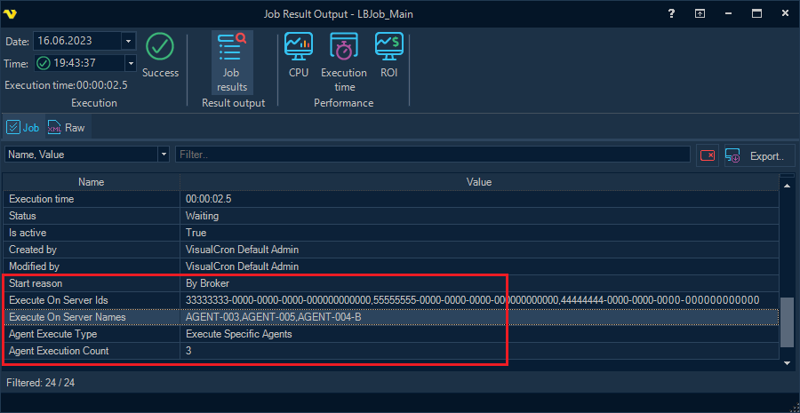

## Execution Distribution

**Execution Distribution** is a setting up of a certain Job so that execution of the Job can be performed not only on the local Server, but also on one or more Servers connected to the Broker.

Distributed execution is configured on the "*Agent distribution*" tab in the Job editing form:

**Supported Job execution modes**
 
* *Execute locally only*

This is the default execution mode.
 
* *Execute on one agent according to selection mode*

Job execution request is sent to the Broker to whom the current Server is connected. The Broker determines on which of the connected Servers the Job should be actually executed.
 
* *Execute on specific number of agent instances*

This mode is similar to the previous one, but the Broker selects a Server for Job execution (and sends the request) the specified number of times.
 
* *Execute on all online agents*

Job execution request is sent to the Broker, which in turn sends a request to each of the connected Agents, taking into account additional filters configured on the Broker's side.
 
* *Execute on specific agents*

If the specified Agents include the current Server, the Job is forced to be executed locally first. Then a request is sent to the Broker for execution on the other specified Agents.
 
**Agent selection and filtering**
 
Load balancer settings specify the method according to which the Agents are selected for Job execution (on the “Distributed execution” tab).

There are the following ways of Agent selection:  
 
* *Round-robin* (for each subsequent Job execution, the next Agent is selected);
* *First* (the first connected Agent is selected);
* *Random* (any connected Agent);
* *Best health* (the Agent with the best Server Health level).
 
There are also two optional filters for selecting Agents to execute the Job:
 
* *Filter agents by global condition* (is configured on the "*Global filter condition*" tab)
* *Filter agents by list*
 
The filtering condition can be, for example, not to run the Job on the Agent, where at least one Job is already running:

See the [Load balancing Conditions](load-balancing-conditions) topic for information on configuring load balancing conditions, as well as supported filtering conditions.
 
 
**Distributed execution history**
 
For the Job with distributed execution settings, the "*Log History*" context menu displays two child items: "*Local execution history*" and "*Distributed execution history*".

If "*Distributed execution history*" is chosen, a history request is sent to each required (and currently available) Agent, then the results are combined and sent back to the user.

:::info Note

the full history of distributed execution is displayed only when requesting history on the Server from which the Job was originally sent to the Broker for execution.

:::