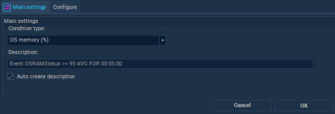
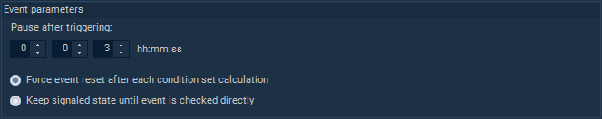
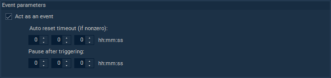

## Load Balancing Conditions

Load balancing Conditions can be used in several different VisualCron components:
 
* Load balancing [Broker](broker-server) (Scheduler switch condition; Server Agents filter)
* Load balancing [Flows](load-balancing-flows) 
* [Server Health](../server/health-server-health) (user changes are not supported)
* [Variable Trigger](../server/event-trigger-variable)
 
**Editing Load balancing Conditions**
 
All Load balancing Conditions are created and edited using a single form consisting of two tabs.
 
On the first tab, the basic properties are configured: condition type and description.

On the second tab, special properties for a particular type of condition are edited.

Depending on the condition type, the following property groups can be edited:
 
* select Server
* select Job
* select Connection
* select Network
* select Time exception
* select Variable
* select file
* select process
* select Windows service
* operand and value to compare with
* duration, including average checkbox
* act as an event (for state-check conditions)
* event parameters (for event-based conditions) 
 
**Condition classification**
 
All Conditions can be divided into two groups: conditions that check some state, and conditions that react to some event in the system.
 
* State-check Condition example: the value of the Variable “TestNumber” is “42“.
* Event-based Condition example: the value of the Variable “TestNumber” has been updated.
* Finally, an example of the state-check Condition acting as an event: the value of the Variable “TestNumber” has been updated and became equal to “42“.
 
**Configuring parameters of an event-based Condition**

**Pause after triggering**

The period after previous triggering when the event generation is suppressed.
If an event occurs in the system before the suppression period has ended, the event will be ignored (see below the difference for state-check conditions).
 
**Force event reset after each condition set calculation** (the default)

The state will be set to nonsignaled when calculating the entire condition tree, regardless of whether the event is checked directly or not.
 
**Keep signaled state until event is checked directly**

The event will remain in the signaled state until it is checked directly during condition calculations.
 
**Configuring parameters of a state-check Condition acting as an event**

**Act as an event**

The next match of the state-check condition is possible only after an unmatched state is detected or reset timeout expires.
 
**Auto reset timeout**

If nonzero, the condition can trigger again after the specified timeout, even if the state matched all the time.
Takes precedence over the “pause after triggering” period, that is, can reduce the suppression period.
 
**Pause after triggering**

The period after previous triggering when the event generation is suppressed.
However, if while waiting for the end of the suppression period, the state changes to non-matching, and then changes back to matching, then immediately after the end of the suppression period, the condition will be triggered again.
 
 
**The list of supported Load balancing Conditions**
 
*Abbreviations*:

* Flows - Load balancing Flows
* Broker - Load balancing Broker
* Health - Server Health
* N/A - not yet available

### Server statistics counters

| Description | Display name | Supported modes | Additional features | Used in components |
| ----------- | ------------ | --------------- | ------------------- | ------------------ |
| VC Server CPU (%) | VCServerCPUStatus | state / event | duration, average | Flows, Broker, Health |
| OS CPU (%) | OSCPUStatus | state / event | duration, average | Flows, Broker, Health |
| VC Server memory (%) | ServerRAMStatus| state / event | duration, average | Flows, Broker, Health |
| OS memory (%) | OSRAMStatus | state / event | duration, average | Flows, Broker, Health |
| Used VC Server Drive space (%) | DiskSpaceStatus | state / event | duration | Flows, Broker, Health |
| Daily Server uptime (%) | ServerUptimeStatus | state / event | | Flows, Broker |
| Maximum [last minute] response time (ms) | MaxResponseTime | state / event | duration | Flows, Broker |  
| Total running Jobs | TotalRunningJobs | state / event | duration, average | Flows, Broker |

### Job statistics and states

| Description | Display name | Supported modes | Additional features | Used in components |
| ----------- | ------------ | --------------- | ------------------- | ------------------ |
| Total # running same Jobs | TotalRunningSameJobs | state / event | duration, average | Flows |
| Job is running | JobIsRunning | state | | Flows |
| Job runtime | JobRunningTime | state / event | duration, average | Flows |
| Job status | JobStatus | state / event | | N/A | 

### Log database

| Description | Display name | Supported modes | Additional features | Used in components |
| ----------- | ------------ | --------------- | ------------------- | ------------------ |
| LogDB size (kB) | LogDBSize | state / event | | Flows |
| LogDB fragmentation (%) | LogDBFragmentation | state / event | | Flows |

### Time Exceptions

| Description | Display name | Supported modes | Additional features | Used in components |
| ----------- | ------------ | --------------- | ------------------- | ------------------ |
| Time Exception collection matches | TimeExceptionMatches | state | | Flows |
| Time Exception occurred | TimeExceptionEnter | event | | N/A |

### Broker connections

| Description | Display name | Supported modes | Additional features | Used in components |
| ----------- | ------------ | --------------- | ------------------- | ------------------ |
| VC Server is connected | VCServerIsConnected | state || Flows |
| VC Server connected | VCServerConnected | event || Flows | 
| VC Server disconnected | VCServerDisconnected | event || Flows | 
| VC Server is responding | VCServerIsResponding | state || N/A |

### Connections API

| Description | Display name | Supported modes | Additional features | Used in components |
| ----------- | ------------ | --------------- | ------------------- | ------------------ |
| Connection is active | ConnectionIsActive | state || N/A | 
| Number of Connection instances | ConnectionInstances | state || N/A |

### Networks API

| Description | Display name | Supported modes | Additional features | Used in components |
| ----------- | ------------ | --------------- | ------------------- | ------------------ |
| Network is connected | NetworkIsConnected | state || Flows |
| Network connected | NetworkConnected | event || Flows |
| Network disconnected | NetworkDisconnected | event || Flows |

### Health API

| Description | Display name | Supported modes | Additional features | Used in components |
| ----------- | ------------ | --------------- | ------------------- | ------------------ |
| Health status | HealthStatus | state / event | duration | Flows, Broker |

### Variables

| Description | Display name | Supported modes | Additional features | Used in components |
| ----------- | ------------ | --------------- | ------------------- | ------------------ |
| Variable value | VariableValue | state / event | duration, average (for numerics) | Flows, Variable Trigger |
| Variable value changed | VariableValueChanged | event || Flows, Variable Trigger |

### External processes

| Description | Display name | Supported modes | Additional features | Used in components |
| ----------- | ------------ | --------------- | ------------------- | ------------------ |
| File status | FileStatus | state / event | duration | N/A |
| Process status | ProcessStatus | state / event | duration | N/A |
| Process CPU (%) | ProcessCPUStatus | state / event | duration, average | N/A |
| Process terminated | ProcessTerminated | event || N/A |
| Windows Service status | WinServiceStatus | state / event | duration | N/A |

### Degenerate cases

| Description | Display name | Supported modes | Additional features | Used in components |
| ----------- | ------------ | --------------- | ------------------- | ------------------ |
| Default (success) | Any ||| Flows, Broker | 
| Default (failure) | None ||| Flows |