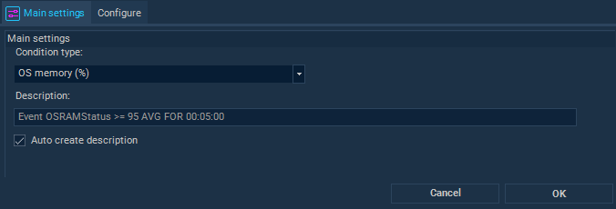
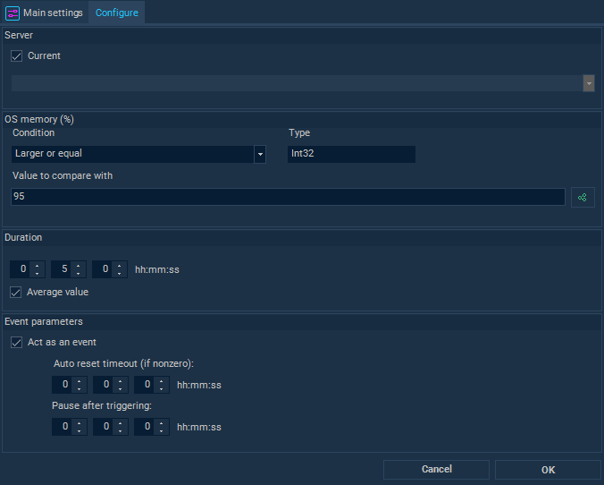
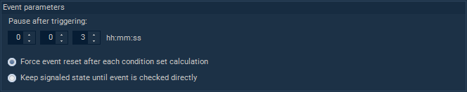
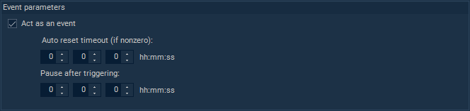

## Load Balancing Conditions

Load balancing Conditions can be used in several different VisualCron components:
 
* Load balancing [Broker](broker-server) (Scheduler switch condition; Server Agents filter)
* Load balancing [Flows](load-balancing-flows) 
* [Server Health](../server/health-server-health) (user changes are not supported)
* [Variable Trigger](../server/event-trigger-variable)
 
**Editing Load balancing Conditions**

All Load balancing Conditions are created and edited using a single form consisting of two tabs.

On the first tab, the basic properties are configured: condition type and description.

On the second tab, properties specific to the chosen condition type are edited.

Depending on the condition type, the following property groups can be edited:

* Server selector
* Job selector
* Connection selector
* Network selector
* Time exception selector
* Variable selector
* File selector
* Process selector
* Windows service selector
* Operand and value to compare with
* Duration, including average checkbox
* Act as an event (for state-check conditions)
* Event parameters (for event-based conditions)
 
**Condition classification**

All Conditions fall into two groups: conditions that check some state, and conditions that react to some event in the system.

* State-check Condition example: the value of the Variable *TestNumber* is `42`.
* Event-based Condition example: the value of the Variable *TestNumber* has been updated.
* State-check Condition acting as an event: the value of the Variable *TestNumber* has been updated and became equal to `42`.
 
**Configuring parameters of an event-based Condition**

**Pause after triggering**

The period after a previous trigger when event generation is suppressed. If an event occurs before the suppression period ends, the event is ignored (the behavior is different for state-check conditions — see below).

**Force event reset after each condition set calculation** (the default)

The state is set to nonsignaled when the entire condition tree is calculated, regardless of whether the event is checked directly or not.
 
**Keep signaled state until event is checked directly**

The event remains in the signaled state until it is checked directly during condition calculations.
 
**Configuring parameters of a state-check Condition acting as an event**

**Act as an event**

The next match of the state-check condition is possible only after an unmatched state is detected or the reset timeout expires.

**Auto reset timeout**

If non-zero, the condition can trigger again after the specified timeout even if the state has matched the whole time. Takes precedence over the *Pause after triggering* period, so it can shorten the suppression period.

**Pause after triggering**

The period after a previous trigger when event generation is suppressed. If, while waiting for the suppression period to end, the state changes to non-matching and then back to matching, the condition triggers again immediately after the suppression period ends.
 
**The list of supported Load balancing Conditions**
 
*Abbreviations*:

* Flows - Load balancing Flows
* Broker - Load balancing Broker
* Health - Server Health
* N/A - not yet available

### Server statistics counters

| Description | Display name | Supported modes | Additional features | Used in components |
| ----------- | ------------ | --------------- | ------------------- | ------------------ |
| VC Server CPU (%) | VCServerCPUStatus | state / event | duration, average | Flows, Broker, Health |
| OS CPU (%) | OSCPUStatus | state / event | duration, average | Flows, Broker, Health |
| VC Server memory (%) | ServerRAMStatus| state / event | duration, average | Flows, Broker, Health |
| OS memory (%) | OSRAMStatus | state / event | duration, average | Flows, Broker, Health |
| Used VC Server Drive space (%) | DiskSpaceStatus | state / event | duration | Flows, Broker, Health |
| Daily Server uptime (%) | ServerUptimeStatus | state / event | | Flows, Broker |
| Maximum [last minute] response time (ms) | MaxResponseTime | state / event | duration | Flows, Broker |  
| Total running Jobs | TotalRunningJobs | state / event | duration, average | Flows, Broker |

### Job statistics and states

| Description | Display name | Supported modes | Additional features | Used in components |
| ----------- | ------------ | --------------- | ------------------- | ------------------ |
| Total # running same Jobs | TotalRunningSameJobs | state / event | duration, average | Flows |
| Job is running | JobIsRunning | state | | Flows |
| Job runtime | JobRunningTime | state / event | duration, average | Flows |
| Job status | JobStatus | state / event | | N/A | 

### Log database

| Description | Display name | Supported modes | Additional features | Used in components |
| ----------- | ------------ | --------------- | ------------------- | ------------------ |
| LogDB size (kB) | LogDBSize | state / event | | Flows |
| LogDB fragmentation (%) | LogDBFragmentation | state / event | | Flows |

### Time Exceptions

| Description | Display name | Supported modes | Additional features | Used in components |
| ----------- | ------------ | --------------- | ------------------- | ------------------ |
| Time Exception collection matches | TimeExceptionMatches | state | | Flows |
| Time Exception occurred | TimeExceptionEnter | event | | N/A |

### Broker connections

| Description | Display name | Supported modes | Additional features | Used in components |
| ----------- | ------------ | --------------- | ------------------- | ------------------ |
| VC Server is connected | VCServerIsConnected | state || Flows |
| VC Server connected | VCServerConnected | event || Flows | 
| VC Server disconnected | VCServerDisconnected | event || Flows | 
| VC Server is responding | VCServerIsResponding | state || N/A |

### Connections API

| Description | Display name | Supported modes | Additional features | Used in components |
| ----------- | ------------ | --------------- | ------------------- | ------------------ |
| Connection is active | ConnectionIsActive | state || N/A | 
| Number of Connection instances | ConnectionInstances | state || N/A |

### Networks API

| Description | Display name | Supported modes | Additional features | Used in components |
| ----------- | ------------ | --------------- | ------------------- | ------------------ |
| Network is connected | NetworkIsConnected | state || Flows |
| Network connected | NetworkConnected | event || Flows |
| Network disconnected | NetworkDisconnected | event || Flows |

### Health API

| Description | Display name | Supported modes | Additional features | Used in components |
| ----------- | ------------ | --------------- | ------------------- | ------------------ |
| Health status | HealthStatus | state / event | duration | Flows, Broker |

### Variables

| Description | Display name | Supported modes | Additional features | Used in components |
| ----------- | ------------ | --------------- | ------------------- | ------------------ |
| Variable value | VariableValue | state / event | duration, average (for numerics) | Flows, Variable Trigger |
| Variable value changed | VariableValueChanged | event || Flows, Variable Trigger |

### External processes

| Description | Display name | Supported modes | Additional features | Used in components |
| ----------- | ------------ | --------------- | ------------------- | ------------------ |
| File status | FileStatus | state / event | duration | N/A |
| Process status | ProcessStatus | state / event | duration | N/A |
| Process CPU (%) | ProcessCPUStatus | state / event | duration, average | N/A |
| Process terminated | ProcessTerminated | event || N/A |
| Windows Service status | WinServiceStatus | state / event | duration | N/A |

### Degenerate cases

| Description | Display name | Supported modes | Additional features | Used in components |
| ----------- | ------------ | --------------- | ------------------- | ------------------ |
| Default (success) | Any ||| Flows, Broker | 
| Default (failure) | None ||| Flows |
