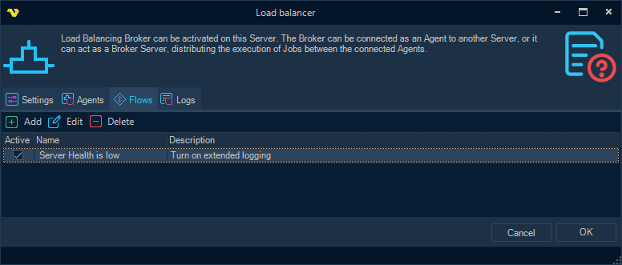
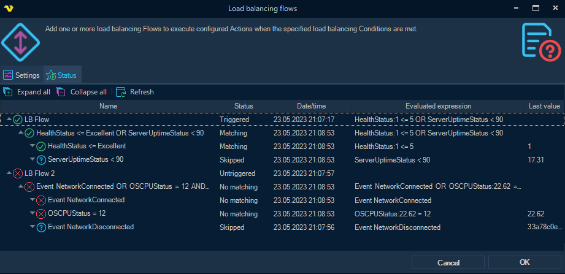

## Load Balancing Flows

Load balancing Flows (**Flows** for short) - allow to perform a set of different Actions depending on the match of certain Load balancing Conditions.

A combination of different Conditions, as well as one or more Actions to be performed when the Conditions match, can be configured for each Flow.
 
Actions in a Flow are performed once the first time the configured Conditions match.
Then an Action can be performed again if a mismatch of the Conditions is detected beforehand (i.e. change of the state of one or another object or service, which resulted in termination of the Condition match), or if a Condition is matched due to the firing of some event in the VisualCron Server (i.e. disconnecting an Agent from the Broker).
 
Load balancing Conditions are configured in the same way as the conditions in the [Event Trigger - Variable](../server/event-trigger-variable) topic.
 
See the [Load balancing Conditions](load-balancing-conditions) topic for information on configuring load balancing Conditions, as well as all supported Conditions.
 
**Supported types of Actions**
 
* *Execute Job*
* *Run Notification*
* *Adjust settings*
* *Start server*
* *Stop server*
 
Currently, the execution of Actions  (except for the actions *Start/Stop server*) is supported on the local Server where Flows are configured and functioning. However, in the case of an Execute Job Action, the specified Job may itself be configured for distributed execution.
Adjust settings Action is reversible, that is, it can be configured so that in case of termination of the Condition match, the previously adjusted settings are reset to their original state.
 
**Configuring and checking the status of Flows at runtime**
 
Flows, together with their Conditions and Actions, can be configured in the Load balancer settings form, as well as in the separate **Load balancing flow**s form, accessible from the main menu (in the **Servers > Execution distribution** menu group).
Additionally, when opening the separate form from the menu, the user can monitor the runtime status of all Flow conditions in the *Status* tab, with automatic (and manual) updates:

**Usage notes**
 
Both Conditions and Actions are universal and not necessarily related directly to load balancing or execution distribution.

For example, if there is significant fragmentation in the local Log database, or CPU usage exceeds threshold, the system administrator can be notified accordingly.

Another example is when, due to a large number of simultaneously running jobs, it might be necessary to temporarily block the launch of new Jobs, or put them in a queue.