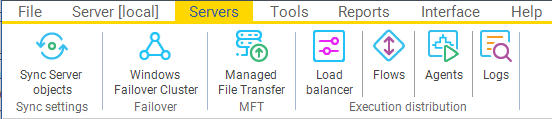

## Servers

The **Servers** tab is a part of the main menu.

Information about the Windows Failover Cluster can be found in the [Using VisualCron in a clustered environment](../../using-visualcron/using-visualcron-in-a-clustered-environment) topic