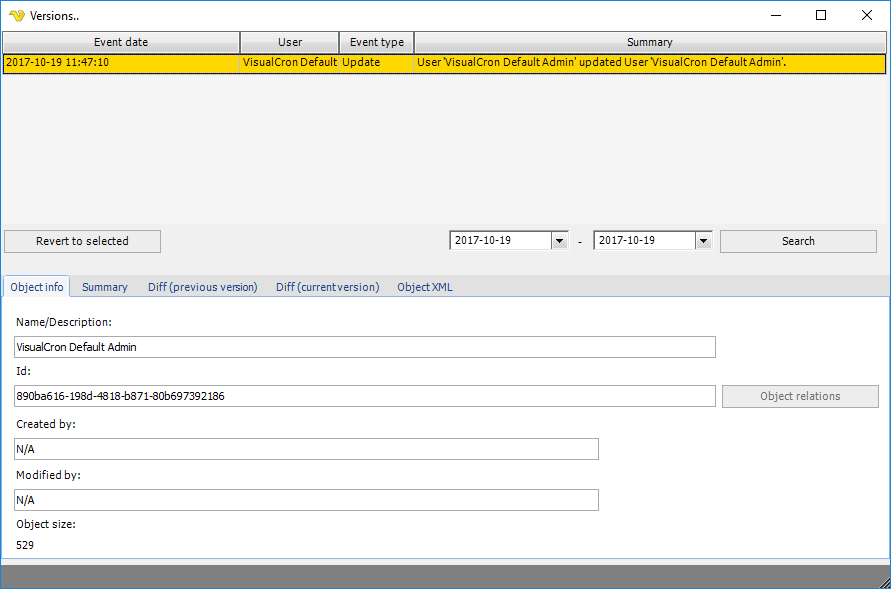

## Versions

The main menu **Tools > Objects > Audit log > Versions** window shows all changes related to a specific object. It is also possible, in detail, to compare the actual changes. You can also revert back to a specific version - let say you made a change and then want to go back to a previous version.
 
**Tools > Objects > Audit log > Versions**

The window is divided in two parts. A list that contains all changes with search functionality and tabs containing info about the selected version.
When clicking on a row the information in the lower part is updated with details about the actual stored object.
 
By default, the versions window only shows the changes of today, to alter this, select another date. The number of days or rows stored is controlled by the same settings for Audit [Log Settings](../server/settings-log-settings).
 
**Revert to selected**

This means that the object that you clicked on (right clicked or selected) will be updated (or re-created if no longer existing). The Revert functionality only updates the object itself - not any relations to it. This means, that if you for example revert a Task that used a Credential (that is no longer existing) that Task may not work until you recreate and reselect that Credential. Reverts are currently logged as Add or Update depending on if they exist from the beginning or not.
 
**Object info** tab

This tab contains basic information like:

* Name
* Id of object
* Created
* Modified
* Object size
 
There is also a [Object relations](object-relations) button so you can see where this object is used.
 
**Summary tab**

This is the same information as in the Summary column but might be easier to read if there are a lot of changes.
 
**Diff (previous version) tab**

This shows, in detail, the property changes between the selected object and the previous version.
 
**Diff (current version) tab**

This shows, in detail, the property changes between the selected object and the current existing object.
 
**Object XML tab**

This shows the XML specification details for the selected object.