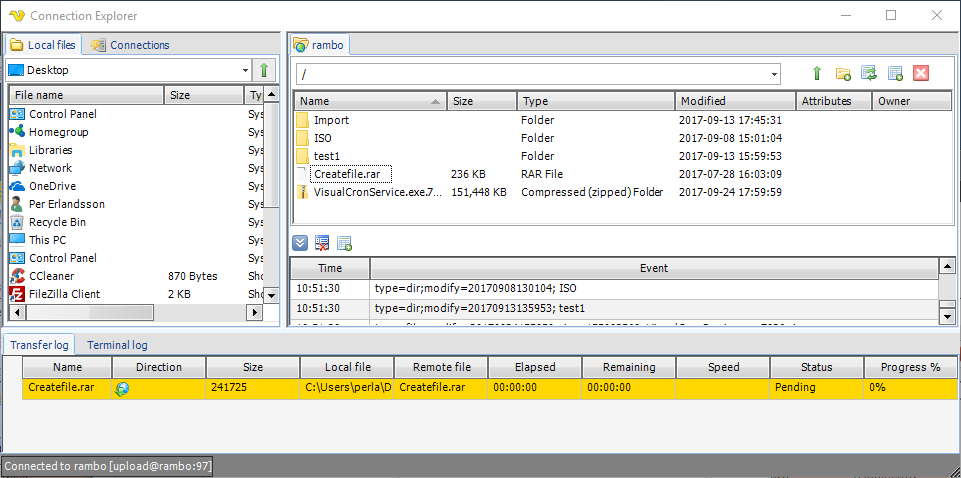
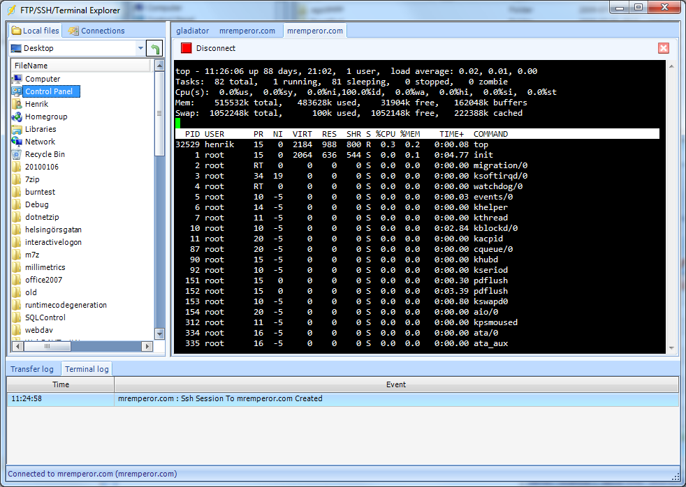
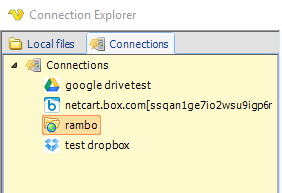

## Explore - Connection Explorer

With the main menu **Tools > Explore > Connection Explorer** option, there is one way to view your remote files, delete and transfer files - on your existing Connections. It is also a way of testing existing Connections and retrieve correct path for download or upload folders.
 
**Tools > Explore > Connection Explorer, FTP Connection**

Tools > Explore > Connection Explorer, SSH Connection

**The Connections list**

The Connection list shows all Connection types that are viewable by this Explorer. You can view FTP, SFTP, Terminal and SSH. You can right click on any connection and choose to set Properties or Connect.
 
**Tools > Explore > Connection Explorer, Connection list**

**Drag and drop support**

When connecting through FTP or SFTP you are able to drag and drop folders or files between source and destination.
 
**Right click menu**

Right click on a file or folder to:

* create a new folder
* delete a file or folder
* view (download and show with default application)
* rename a file or folder
* cut/copy/paste file or folder
* get properties of file or folder
 
**Limitations**

Some FTP servers require special parsing due to non-standard output. These may not work in the Client but work in the Tasks.