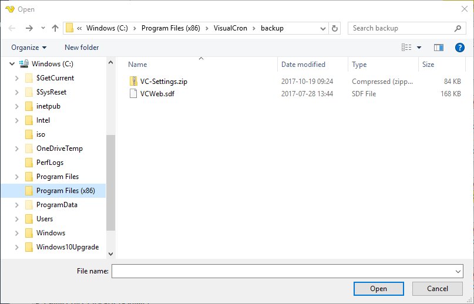

## Explore - File Explorer

With the main menu **Tools > Explore > File Explorer** option, you can view folders and files. The File Explorer behaves differently depending on if you are locally or remotely connected.
 
When you are remotely connected a different dialog will show that allows you to:

* Copy/Paste files and folders
* Upload a local file or folder to a remote folder
* Delete files and folders
* Rename files and folders
* Search for files remotely
 
**Tools > Explore > File Explorer**

**Upload files and folders**

Drag a file or a folder from a local folder into the File Explorer to copy a file/folder.
 
**Search files**

To search files use the field to the upper right and enter a value and press enter or search button. Press the search field X icon to clear a search result and revert back to original listing. Please note that we do not recommend searching a very large folder as it make take a long time and that the user interface will be blocked during that time.