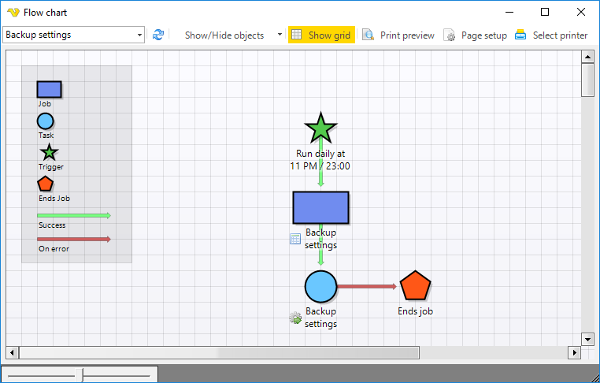

## Flow Chart - Flow Chart

The main menu T**ools > Flow chart > Flow char**t option lets you view the internal steps within a Job. There are many ways to control the flow between Tasks. The Flow charts shows Triggers, Conditions, Tasks and Notifications.
 
**Tools > Flow chart > Flow chart**

**Job selection**

In the Jobs selection drop-down list shows you select which Job you would like to explore.
 
**Refresh button**

Refreshes the current view.
 
**Show/Hide objects**

In this menu you can check/uncheck which objects (Triggers, Conditions, Notifications, On error and Legend) the chart will show.
 
**Show grid**

Enables or disables the background grid.
 
**Print preview**

Opens the print preview window.
 
**Page setup**

Shows the printer page setup window.
 
**Select printer**

Opens the printer selection window.
 
**Flow chart**

The flow chart window includes the objects that is displayed in the top left area. A flow chart is drawn from top to bottom.

The following action can be performed:

* open an object for edit by double clicking on it
* hide a specific object type by right clicking on it and choose hide
* hover over each object (and arrows) to see details
 
**Permission**

To block a user from viewing the Job report you need to disable the Jobs Read property in [User permissions > Groups](../server/main-user-permissions).

