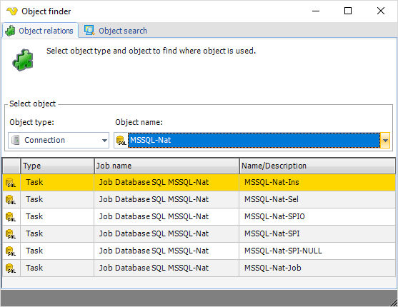

## Objects - Object Relations

The main menu **Tools > Objects > Object relations** option helps you to find relations between objects within VisualCron. Since many objects are "global" and can me reused, multiple relations may exist. It can be useful to know which relations an object have before deleting as it can be used in many places.
 
**Tools > Objects > Object relations** tab

**Object type**

Select the object type and all names of that object type will be listed under object name.
 
**Object name**

Once you have filtered out the object type you can select the name. When the name has been selected all internal objects, that use this object, will be listed in the grid below. For example, in the image above you can see that the Condition named "Check for file" is used in the Job "Test Job".
 
**Result grid**

In the result grid all objects that use the object name is listed. You can double click to edit any object that is listed in the grid.
 
The **Object finder > Object search** tab, in the above window, opens a window which uses the same structure as the main menu **Tools > Objects > Object search** option. See [here](object-search) for more information.