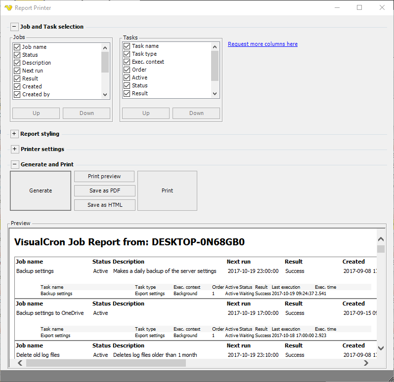

## Report - Print Job Report

The **Reports** option lets you generate reports based on your Jobs, Tasks, Server, Connections and Notifications. Each report opens in its own window where it is rendered as a document that you can review, print or copy.

The available reports are grouped by area, for example:

* **Jobs** - Overview, List, Result, Executions, ROI, Time distribution and Next execution
* **Tasks** - Overview
* **Server** - Health, Optimization, Overview and SLA
* **Connections** - Overview and Executions
* **Notifications** - Overview
 
**Tools > Report > Print job** report

**Date range**

Where applicable, a *From* and *To* date filter controls the period the report covers. By default the last 7 days are shown.

**Show**

The *Show* button generates the report (and refreshes it after you change the date range). While the report is being generated the button changes to *Cancel*.

**Theme**

The theme drop down lets you switch the report styling between *Dark Blue*, *Dark Grey* and *Light Grey*.

**Print**

The *Print* button prints the report.

**Copy HTML**

The *Copy HTML* button copies the report as HTML to the clipboard.

**Permission**

To block a user from viewing the Job report you need to disable the Jobs Read property in [User permissions > Groups](../server/main-user-permissions).
