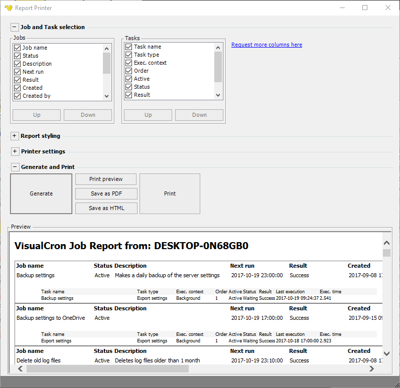

## Report - Pring Job Report

The main menu **Tools > Report > Print job report** option allows you to print or create documents which contains settings from Jobs and Tasks.
 
**Tools > Report > Print job** report

**Job and Task selection**

In the Job and Task selection group box you select which columns to include in the report. You can select columns from common/generic properties of Jobs and Tasks.
 
**Report styling**

The report styling group allows you to control header/footer and Jobs/Tasks details.
 
**Printer settings**

The printer settings group box lets you select printer, orientation and other common printer properties.
 
**Generate and print**

**Generate**

The generate button creates the report (based on column and styling settings) which will be visible in the Preview window.
 
**Print preview**

The Print preview button shows the print preview window.
 
**Save as PDF**

The Save as PDF button generates a PDF file and allows you to save it anywhere in the file system.
 
**Save as HTML**

Saves the report as HTML.
 
**Print**

Prints the report according to preview window on the selected printer.
 
**Permission**

To block a user from viewing the Job report you need to disable the Jobs Read property in [User permissions > Groups](../server/main-user-permissions).