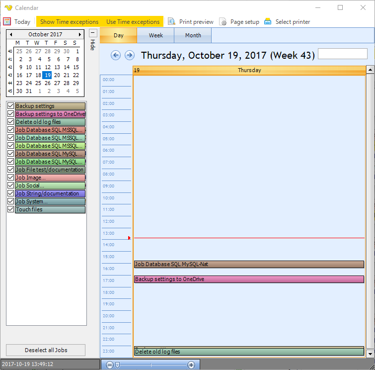

## Schedule - Calendar

The main menu **Tools > Schedule > Calendar** option presents an overview of scheduled Jobs. This way you can, for example, plan your Tasks (so they don't run at the exact same time).
 
**Tools > Schedule > Calendar**

**Permission**

To block a user from viewing the Job report you need to disable the Jobs Read property in [User permissions > Groups](../server/main-user-permissions).