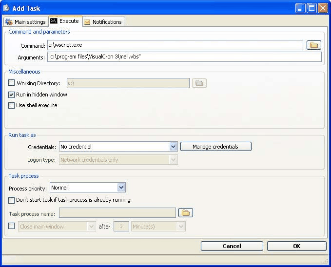

## Scripts

By using scripts you can perform almost anything in Windows. There are several scripting languages that you can use, where the most common are:
•VBScript
•PHP
•Perl
 
All these scripting languages are free to use. Look at the section for each scripting language about how to install and use it with VisualCron.
 
To execute external scripts on another web server, use the Job type "HTTP" to POST or GET to a script on a server. Read more about it [here](https://en.wikipedia.org/wiki/API).

### Using PHP for Scripting

Using PHP to perform Tasks on the computer provides many options. With PHP you can for example connect to different databases, read and process files, send mail, print files etc. PHP is quite easy to learn and is free for download. To read more about PHP and download the package go here.
 
After installing and configuring PHP in your way, it is easy to call your scripts from VisualCron. In the Command field, enter the full path to the php.exe file, normally "C:\php\php.exe". In the Arguments field you can enter several parameters to php.exe, for example "-q yourscript.php". This executes the script in a quiet mode and no window is shown.
 
Watch out if you use relative links in your script, if you do that you may want to specify a Working directory so that script knows where to find the relative paths.

### Using VBScript for Scripting

#### What is VBScript?

Microsoft Visual Basic Scripting Edition brings active scripting to a wide variety of environments, including Web client scripting in Microsoft Internet Explorer and Web server scripting in Microsoft Internet Information Service.

#### Easy to Use and Learn

If you already know Visual Basic or Visual Basic for Applications (VBA), VBScript will be very familiar. Even if you do not know Visual Basic, once you learn VBScript, you are on your way to programming with the whole family of Visual Basic languages. Although you can learn about VBScript in just these few Web pages, they do not teach you how to write the code. To learn programming, take a look at Step by Step books available from Microsoft Press.

#### Windows Script

VBScript talks to host applications using Windows Script. With Windows Script, browsers and other host applications do not require special integration code for each scripting component. Windows Script enables a host to compile scripts, obtain and call entry points, and manage the namespace available to the developer. With Windows Script, language vendors can create standard language run-time modules for scripting. Microsoft will provide run-time support for VBScript. Microsoft is working with various Internet groups to define the Windows Script standard in order to make scripting engines interchangeable. Windows Script is used in Microsoft® Internet Explorer and in Microsoft® Internet Information Service.
 
#### Using VBScript in VisualCron

To execute VBScript from VisualCron you specify "wscript.exe" in the Command field. In the Arguments field you specify the full path to your script, for example "C:\myscripts\dosomething.vbs".

### Third-Party Tools

You can use VisualCron to run and control any other program. For example can you start a backup program at a certain time. Another example is to use VisualCron to record radio shows at certain times.
 
If you have any good program/utility that you use with VisualCron then please use the [contact web page](https://www.visualcron.com/contact.aspx) and tell us about it!

#### NirCmd

NirCmd is a small command line utility that allows you to do some useful Tasks without displaying any user interface. By running NirCmd with a simple command line option, you can write and delete values and keys in the Registry, write values into a INI file, dial to your internet account or connect to a VPN network, restart windows or shut down the computer, create shortcut to a file, change the created/modified date of a file, change your display settings, turn off your monitor, open the door of your CD-ROM drive, and more.
 
NirCmd can be found [here](http://www.nirsoft.net/utils/nircmd.html).