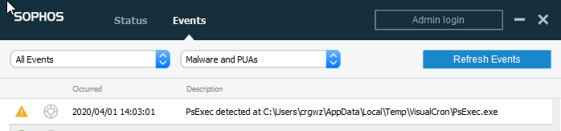
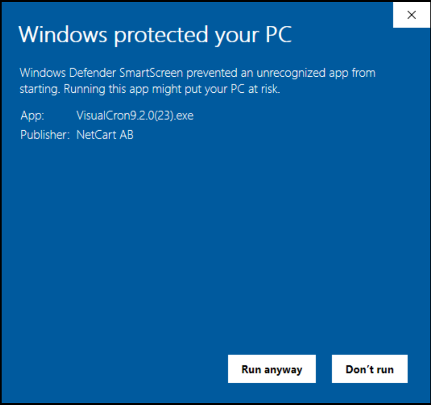

## Download, Install, Upgrade, and Uninstall

**Download**

VisualCron utilizes functions and features in the .NET Framework 4.8. The .NET runtime, typically Version 4.8 Redistributable Package, can be downloaded from [Microsoft](https://dotnet.microsoft.com/en-us/download/dotnet-framework/net48).
 
Download the latest VisualCron version from [VisualCron](https://www.visualcron.com/download.aspx). Download older versions [here](https://www.visualcron.com/download-latest.aspx).
 
To create "silent package" (non exe package) follow these steps:
 
1. download old version [here](https://www.visualcron.com/download-latest.aspx)
2. install 7-Zip File Manager
3. right click on exe and choose extract to folder
 
**Backup**

Always make a backup of existing settings to a safe location before upgrading. This way you can rollback to any previous version if needed. You backup existing settings by connecting with Client to Server. Choose **File > Import/Export > Export settings** tab.
 
**Install/Upgrade**

The below steps cover how to install VisualCron. Please note that the installer uninstalls the current installation. No manual uninstall needed first.
 
1.Double click on the VisualCron.exe install executable and the below window will appear. This is the pre-installer that is preparing installation files for the msi package - for example, stopping existing applications and uninstalling VisualCron.

2. When the pre-installer is complete it starts the msi-package

3. Select I Agree in the License Agreement page and click Next

4. The VisualCron installation executable contains installation files both for the VisualCron Client and the Server. You may choose to install both by selecting the first item or just the Client by selecting the second item. When installing just the client the service for the Server will still be installed but "Disabled". If you later need to run the Server on this computer, you can change the service to "Automatic" in Control Panel > Administrative tools > Services > VisualCron and then mark and "Start" the service. Click Next to continue.

5. Now it is time to choose the installation folder. If you have no objections of the suggested choice just leave it as it is. Click Next to continue.

6. This window shows that VisualCron is ready to copy the files and perform the installation. Click *Next* to continue.

7. The installation has been started and the progress bar shows the current status. Please be patient. The installation may take some minutes depending on the speed of your computer.

8. The install is now finished. If you have a previous VisualCron installation, it will be uninstalled in the background. Click *Close* to continue. When you have closed the msi-installtion the pre-installer asks you if you want to start the VisualCron Client. Click Yes to start it.

9. The Client is starting. If you get a connection error at startup then wait 60 seconds and click Yes to reconnect. There is a lot of configuration and loading during startup which might affect first time startup time for the Server.

**Firewall**

If you have some kind of firewall activated, this application might require user interaction during installation and the initial start of VisualCron. A firewall should detect both that VisualCron is trying to act as a server and that VisualCron is trying to access internet. Normally, you shall respond with something like "allow all connections on all ports" for VisualCron initiated requests.
 
**Upgrade**

If you already have VisualCron installed, you will get an upgrade message when trying to install. This message informs about the current version and what version you are about to install. Click OK to this message to upgrade.
 
**Uninstall/Remove**

VisualCron can be uninstalled by opening the Control Panel -> Add/Remove programs. Browse down to "VisualCron x.x.x", select and click on the Remove button. If you can't find the "VisualCron 5.x.x" entry in Add/Remove programs list, you may have to run the VisualCron installation program again which will open a window with a remove option.
 
### Installation troubleshooting
 
**MSI errors**

1. Download  the silent package from the VisualCron download page.
2. Extract it
3. Open command prompt
4. Write something like to log the installation file: msiexec /i "C:\MyPackage\Example.msi" /L*V "C:\log\example.log"
5. Send the log file to support@visualcron.com
 
**Antivirus and problems with psexec.exe**

Your antivirus may block installation of a file called psexec.exe included in our package:

PsExec is a tool from Microsoft used for remote execution 

[https://docs.microsoft.com/en-us/sysinternals/downloads/psexec](https://docs.microsoft.com/en-us/sysinternals/downloads/psexec). 

We use it for optional remote VisualCron installation (from the Client). You can safely allow this file for installation.
 
 
**Windows Defender SmartScreen**

Sometimes our application need to validate and gain reputation (when new version). Then you might get a popup like below when trying to install. As long as you see publisher "NetCart AB" the file is safe.

