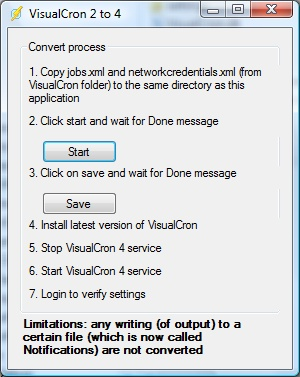

## Upgrading From VisualCron 2.x to 4.x

The VisualCron 4 (VC4) release is the most reworked version since the introduction of VisualCron. Fundamental changes have been made in most parts of the application in order to increase functionality, quality and performance. It is the result of the large amount of requests that have been received from our customers.
 
VC4 is by default stored in C`:\Program Files\VisualCron 4\`. The reason for a different folder than VC2, is the difference in file structure and formats.
 
Also, the installation utility is changed in VC4 which means that if you install VC4, it will not uninstall the present VC2 version. An existing VC2 installation will remain until you uninstall it via the Windows Control panel.
 
The VC4 Job file (jobs.xml) is not compatible with VC2 even though the file name not is changed. The VC4 version of jobs.xml is now stored in the settings folder (not in the installation root folder as for VC2).
 
Furthermore, Import and Export between VC4 and VC2 does not work. One reason is that the VC4  Job type is more complex than VC2.
 
**UPDATE 2008-05-20**
 
We have created a simple upgrade tool that may help you but not all the way. Please download it here and follow the instructions on the screen. [http://www.visualcron.com/files/VisualCron2-4.zip](http://www.visualcron.com/files/VisualCron2-4.zip)

