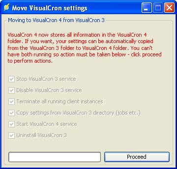

## Upgrading From VisualCron 3.x to 4.x

The below window will only appear as a part of the installation if you have VisualCron 3 and upgrade to VisualCron 4.
 
This window informs you that VisualCron 4 now will exist in the VisualCron 4 folder and all settings will be copied from the VisualCron 3 folder. Click *Proceed* to continue.

