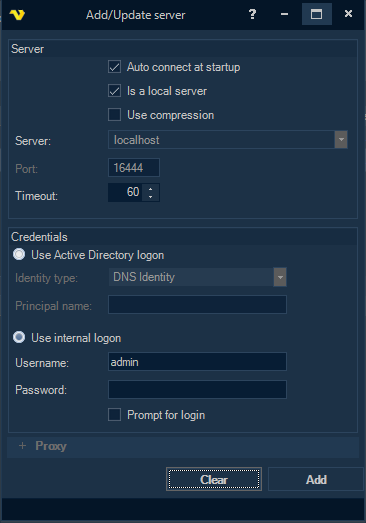

# First Connection

When you launch the VisualCron Client, a login window opens automatically. By default, the Client connects to a local server (`localhost:16444`) using the default credentials.

## Default login

| Field | Default value |
|-------|--------------|
| Server | `localhost` |
| Port | `16444` |
| Username | `admin` |
| Password | *(blank)* |

:::warning Change your credentials

After your first login, immediately change the default username and password at **Server > Main Settings > User Permissions**.

:::

## Logging in

1. Launch the VisualCron Client. The login window appears.
2. Select a server connection from the dropdown (or use the default `localhost`).
3. Enter your username and password.
4. Click **Connect**.

If the server is still starting up, you may see a connection error. Wait 60 seconds and try again.

## Managing server connections

Go to **File > Servers > Manage Servers** to add, edit, or delete server connections.

*Fig. 1 — The Manage Servers window. Add, edit, and delete server connections from here.*

### Add a server connection

1. In the Manage Servers window, click **Add**.
2. Fill in the connection details:

| Field | Description |
|-------|-------------|
| **Server** | Hostname or IP address. Default: `localhost` |
| **Port** | Default: `16444`. Must match the server's configured port. |
| **Is a local server** | Check this when connecting to the same machine — speeds up login significantly. |
| **Username / Password** | Your VisualCron user credentials. |
| **Auto connect at startup** | Automatically connects to this server when the Client launches. |
| **Prompt for login** | Shows a password prompt at each connection. |

3. Click **Add** to save.

*Fig. 2 — The Add/Update Server dialog. Configure the server address, port, and login credentials.*

### Scan for servers

The Manage Servers window can scan your network for Windows and VisualCron servers automatically. Click the **Scan** button to discover available servers.

## Switching between servers

Click any server entry in the **Server/Job/Task** grid to switch connections instantly. You can also use the toolbar dropdown (top-left, showing the current server like `admin@localhost:IPC`) and click the **Connect** icon.

*Fig. 3 — The toolbar server switcher. Use the dropdown to select a server and the connect icon to switch.*

## Authentication options

VisualCron supports two authentication modes:

- **Internal logon** — Username/password stored in VisualCron
- **Active Directory logon** — AD credentials. Enable under **Server > Main Settings > User Logon Settings**

## Troubleshooting

**"Client and server cannot communicate — do not process a common algorithm"**
TLS 1.2 may be disabled on the machine. Install .NET 4.7 or later and reboot.

**Connection timeout on first start**
The VisualCron Server service needs up to 60 seconds to fully initialize after installation. Wait and retry.
